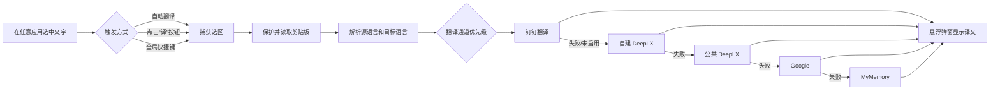
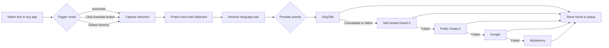

# 划词翻译 · Selection Translator

> 一款支持 macOS 与 Windows 安装包的全局划词翻译工具。选中文字，使用快捷键或选区旁的“译”按钮，即可在当前内容附近查看译文。
>
> A global selection translation utility with macOS and Windows packages. Select text anywhere, press a shortcut or click the floating translate button, and read the translation without leaving your current application.

[](https://www.electronjs.org/)
[](https://www.electronjs.org/)
[](https://www.typescriptlang.org/)
[](./package.json)

**版本 / Version：`0.1.0`** · **当前界面语言 / Current UI language：简体中文 / Simplified Chinese**

<p align="center">
  <a href="#中文文档">中文文档</a> ·
  <a href="#english-documentation">English Documentation</a>
</p>

---

## 中文文档

### 目录

- [产品简介](#产品简介)
- [核心能力](#核心能力)
- [工作流程](#工作流程)
- [下载安装](#下载安装)
- [开发环境](#开发环境)
- [运行项目](#运行项目)
- [首次授权：辅助功能](#首次授权辅助功能)
- [快速使用](#快速使用)
- [设置说明](#设置说明)
- [翻译通道与降级策略](#翻译通道与降级策略)
- [配置自建 DeepLX](#配置自建-deeplx)
- [配置钉钉企业翻译](#配置钉钉企业翻译)
- [隐私与安全](#隐私与安全)
- [项目结构](#项目结构)
- [开发、测试与打包](#开发测试与打包)
- [常见问题](#常见问题)
- [已知限制](#已知限制)
- [参与贡献](#参与贡献)
- [许可证](#许可证)

### 产品简介

划词翻译是一款面向 macOS 的桌面效率工具，常驻系统菜单栏，不需要复制、切换浏览器或打开独立翻译网页。它通过系统级选区监听和受控的复制取词流程，获取当前应用中的选中文字，并在选区附近显示轻量翻译弹窗。

适合以下场景：

- 阅读英文网页、技术文档、论文和 PDF；
- 在 IDE、终端、Office、即时通讯工具中快速理解单词或短句；
- 需要在不离开当前工作流的情况下反复查看译文；
- 希望使用自建 DeepLX 或企业内部钉钉翻译服务的个人和团队。

### 核心能力

- **全局划词翻译**：支持浏览器、Office、PDF、聊天软件等支持系统复制的应用。
- **三种触发模式**：
  - **自动翻译**：完成划词后直接打开弹窗并开始翻译；
  - **选区按钮**：完成划词后显示“译”按钮，点击后才翻译；
  - **仅快捷键**：划词不自动响应，仅通过全局快捷键触发。
- **轻量悬浮弹窗**：显示原文、译文、语言方向和实际使用的翻译通道。
- **弹窗固定**：点击图钉后，弹窗不会因点击外部或自动隐藏计时而关闭。
- **自动隐藏**：可选择不自动隐藏，或在 3、5、8、15 秒后关闭。
- **语言自动适配**：目标语言为“自动中英互译”时，中文默认翻译为英文，其他文本默认翻译为中文；也支持手动指定源语言和目标语言。
- **多语言支持**：内置中文、英语、日语、韩语、法语、德语、西班牙语、葡萄牙语、意大利语、荷兰语、波兰语、俄语、土耳其语、印尼语、乌克兰语、阿拉伯语、瑞典语、丹麦语、捷克语、希腊语、芬兰语、匈牙利语、罗马尼亚语、斯洛伐克语、保加利亚语、立陶宛语、拉脱维亚语、爱沙尼亚语和斯洛文尼亚语。
- **多通道自动降级**：钉钉翻译、自建 DeepLX、公共 DeepLX、Google 和 MyMemory 按优先级尝试；当前通道失败或熔断时自动切换后续通道。
- **翻译缓存与熔断**：相同文本和语言设置会优先读取缓存；失败通道进入冷却期，避免连续请求拖慢后续划词。
- **剪贴板保护**：取词前保存剪贴板，取词完成后尽量恢复原文本或图片；如果用户在取词期间主动复制，则不覆盖用户的新内容。
- **网络代理**：支持跟随系统代理、直连、自定义 HTTP/HTTPS/SOCKS4/SOCKS5 代理和绕过规则。
- **钉钉企业翻译**：可接入企业内部应用，支持 CorpId、ClientId、ClientSecret 配置、在线检测和显式清除凭证。
- **自建 DeepLX**：支持填写自建服务地址，并提供在线检测和 Docker 部署命令生成。
- **明暗主题**：渲染界面跟随 macOS 系统浅色/深色外观。
- **菜单栏常驻**：可从菜单栏快速切换源语言、目标语言、打开设置或退出应用。

### 工作流程



### 下载安装

#### 方式一：下载 GitHub Release

如果项目已发布桌面安装包，可在 GitHub 的 [Releases](../../releases) 页面下载对应系统的文件：

- **macOS**：下载 `.dmg`，打开后将“划词翻译”拖入“Applications”，首次启动时授予“辅助功能”权限；
- **Windows x64**：下载 `SelectionTranslator-<版本>-Setup-x64.exe`，运行安装向导，可选择安装目录并创建桌面/开始菜单快捷方式。

当前 macOS 打包配置默认面向 Apple Silicon（`arm64`）。Intel Mac 用户可从源码按 `x64` 架构重新打包；Windows 安装包默认使用 NSIS 生成 `x64` 安装程序，详见[开发、测试与打包](#开发测试与打包)。

#### 方式二：从源码运行

```bash
# 克隆项目
 git clone <your-repository-url>
cd translation

# 安装依赖
npm install

# 启动 Electron 开发模式
npm run dev
```

> 将 `<your-repository-url>` 替换为实际仓库地址。当前项目没有在 README 中写死仓库 URL，便于迁移到不同 GitHub 仓库。

### 开发环境

| 项目 | 要求 |
| --- | --- |
| 操作系统 | macOS；构建 Windows 安装包建议使用 Windows 10/11 x64 |
| Node.js | `>= 18`，建议使用 Node.js 20 或更高版本 |
| 包管理器 | npm |
| 桌面框架 | Electron 33 |
| 构建工具 | electron-vite、Vite、electron-builder |
| 编程语言 | TypeScript 5.x |
| 原生依赖 | `uiohook-napi`，用于全局鼠标和键盘事件监听 |

如果 `uiohook-napi` 在本机需要重新编译，请确保本机已安装适用于 Node/Electron 原生模块的编译工具链。

### 运行项目

```bash
# 开发模式：启动 Electron + Vite
npm run dev

# 预览已构建的渲染产物
npm run preview

# TypeScript 类型检查
npm run typecheck

# 执行单元测试
npm test
```

启动成功后，应用不会显示传统主窗口，而是常驻 macOS 菜单栏。点击菜单栏中的“译”图标即可打开语言切换和设置菜单。

### 首次授权：辅助功能

划词取词依赖 macOS 的“辅助功能”权限。应用会通过系统级方式模拟 `Command+C`，读取当前前台应用的选中文字，因此首次使用前必须授权。

1. 打开 **系统设置 → 隐私与安全性 → 辅助功能**；
2. 在列表中添加并勾选“划词翻译”；
3. 如果使用开发模式，请添加并勾选 `Electron`；
4. 完全退出并重新启动应用；
5. 再次选中文字进行测试。

如果没有权限：

- 自动翻译模式启动时会主动提示并尝试打开系统设置页面；
- 手动触发失败时，翻译弹窗会显示授权提示；
- 未授权时无法稳定读取其他应用中的选中文字。

### 快速使用

#### 方式一：选区按钮（默认）

1. 在任意支持复制文本的应用中选中文字；
2. 等待选区右上角出现“译”按钮；
3. 点击“译”按钮；
4. 在悬浮弹窗中查看翻译结果。

#### 方式二：自动翻译

在设置中将“触发方式”改为“划词后自动打开并翻译”。之后完成选词即可直接打开翻译弹窗。

#### 方式三：全局快捷键

默认快捷键为 `Alt+T`。在 macOS 上，`Alt` 对应键盘上的 `Option（⌥）`，因此默认操作是：

```text
选中文字 → 按 Option + T（⌥T）
```

快捷键可在设置中修改。不要将 `Command+C`、`Control+C` 等系统复制快捷键设置为翻译快捷键，应用会拒绝注册这些组合，避免干扰正常复制。

#### 弹窗操作

- **图钉**：固定或取消固定弹窗；
- **复制**：将当前译文写入系统剪贴板；
- **语言选择器**：临时修改源语言和目标语言并重新翻译；
- **齿轮**：打开设置窗口；
- **关闭**：点击“×”或按 `Esc` 关闭弹窗。

### 设置说明

设置窗口支持修改后自动保存并立即生效。

| 设置项 | 说明 | 默认值 |
| --- | --- | --- |
| 目标语言 | 选择固定目标语言，或使用自动中英互译 | 自动中英互译 |
| 源语言 | 选择固定源语言，或自动检测 | 自动检测 |
| 触发方式 | 自动翻译、选区按钮、仅快捷键 | 选区按钮 |
| 全局快捷键 | Electron accelerator 格式，例如 `Alt+T`、`Cmd+Shift+Y` | `Alt+T` |
| 结果自动隐藏 | 选择 0、3、5、8 或 15 秒 | 不自动隐藏 |
| 代理模式 | 系统代理、直连、自定义代理 | 跟随系统代理 |
| 自建 DeepLX | DeepLX `/translate` 服务地址，留空表示关闭 | 未配置 |
| 钉钉翻译 | 企业内部应用翻译通道 | 关闭 |

#### 配置文件位置

公开设置保存在 Electron 的 `userData` 目录中。根据运行方式，目录名通常为：

```text
# 开发模式
~/Library/Application Support/selection-translator/settings.json

# 打包应用（以 productName 为目录名）
~/Library/Application Support/划词翻译/settings.json
```

钉钉 `ClientSecret` 会在同一个 `userData` 目录下单独保存为 `credentials.json`：

```text
~/Library/Application Support/<userData>/credentials.json
```

不同版本的设置会通过 `schemaVersion` 自动迁移。修改设置文件前请先退出应用，并建议备份原文件。

### 翻译通道与降级策略

翻译请求默认按以下顺序执行：

| 优先级 | 通道 | 启用条件 | 说明 |
| ---: | --- | --- | --- |
| 1 | 钉钉翻译 | 已启用、配置完整、语言对受支持 | 企业内部应用通道；失败后自动降级 |
| 2 | 自建 DeepLX | 设置了服务地址 | 推荐，适合长期个人使用或内网部署 |
| 3 | 公共 DeepLX | 始终作为默认兜底通道 | 免费公共服务，可能限流或不可用 |
| 4 | Google | 网络可访问 Google 翻译接口 | 使用非官方接口，部分网络需要代理 |
| 5 | MyMemory | 前面通道均失败 | 免费兜底，字符额度和质量受服务限制 |

运行时还会：

- 缓存相同文本、源语言和目标语言组合的结果；
- 在弹窗状态栏显示实际使用的翻译通道；
- 对失败通道执行临时熔断，冷却结束后自动恢复尝试；
- 单次输入最长处理 5000 个字符；Google 和 MyMemory 通道会按各自限制进一步截断请求；
- 钉钉未启用、配置不完整或语言对不支持时，不会产生钉钉网络请求。

公共翻译服务的可用性、限流、配额和服务条款可能随时变化。若需要更稳定的个人使用体验，建议部署自建 DeepLX。

### 配置自建 DeepLX

自建 DeepLX 是推荐的稳定方案。完整部署说明请查看：[docs/deeplx-selfhost.md](docs/deeplx-selfhost.md)。

快速流程：

1. 准备 DeepL 免费账号；
2. 按 DeepLX 官方说明获取 `dl_session`；
3. 使用 Docker 启动本地 DeepLX；
4. 在应用设置的“自建 DeepLX”中填入服务地址；
5. 点击“检测是否在线”。

示例部署命令：

```bash
docker run -d \
  --name deeplx \
  --restart unless-stopped \
  -p 1189:1188 \
  -e TOKEN=你的dl_session值 \
  ghcr.io/owo-network/deeplx:latest
```

然后在设置中填写：

```text
http://127.0.0.1:1189/translate
```

> `dl_session` 是敏感凭证，请不要提交到 Git、截图或公开聊天。DeepLX 依赖第三方网页服务，可能因上游改版而暂时失效；请以 DeepLX 官方项目说明为准。

### 配置钉钉企业翻译

钉钉翻译适用于已创建企业内部应用并开通 AI 文本翻译权限的账号。

1. 在钉钉开放平台创建企业内部应用；
2. 为应用开通 **AI 文本翻译** 权限；
3. 在应用设置中准备 `CorpId`、`ClientId` 和 `ClientSecret`；
4. 打开“划词翻译 → 设置…”；
5. 在“钉钉翻译”区域启用通道并填写公开配置；
6. 点击“保存钉钉配置”；
7. 点击“检测配置”，确认 Token 获取和文本翻译链路可用。

安全行为：

- `ClientSecret` 只通过设置页提交给 Electron 主进程；
- 使用 Electron `safeStorage` 加密后单独写入 `credentials.json`；
- 普通 `settings.json`、渲染进程设置快照和日志不会保存或显示明文 Secret；
- ClientSecret 输入框留空并保存其他字段时，会保留旧凭证；
- 如需删除凭证，必须点击“清除 Secret”；
- 配置不完整、语言不支持、权限不足、限流或网络失败时，会自动降级到其他翻译通道。

### 隐私与安全

请在使用前了解以下数据流：

1. 应用通过 macOS 辅助功能和受控复制流程读取当前选中文字；
2. 选中文字会根据当前通道发送给对应的翻译服务；
3. 如果配置了自建 DeepLX，可将请求发送到你的本机、局域网或自有服务器；
4. 如果自建通道不可用，应用可能继续请求公共 DeepLX、Google 或 MyMemory；
5. 翻译结果会在本地弹窗中显示，并可由用户主动复制。

因此，不建议直接翻译密码、API Key、客户隐私、未公开源代码或其他敏感内容。使用第三方翻译服务时，请自行评估其隐私政策、数据保留、配额和服务条款。

本项目不提供云端账户系统。钉钉凭证仅在启用钉钉通道并完成配置后使用；应用公开设置中只保存 CorpId、ClientId 和“Secret 是否已配置”的状态，不保存明文 ClientSecret。

### 项目结构

```text
.
├── src/
│   ├── main/                         # Electron 主进程
│   │   ├── index.ts                  # 应用入口、托盘、IPC、快捷键与流程编排
│   │   ├── capture.ts                # 剪贴板取词、权限检测与剪贴板恢复
│   │   ├── translate.ts              # 翻译通道、缓存、熔断与降级策略
│   │   ├── network.ts                # 独立翻译网络会话与代理
│   │   ├── autoTrigger.ts            # 全局鼠标/键盘监听
│   │   ├── selectionButton.ts        # 选区旁“译”按钮
│   │   ├── popup.ts                  # 翻译悬浮窗
│   │   ├── settings.ts               # 设置持久化与规范化
│   │   ├── dingtalkConfig.ts         # 钉钉公开配置编排
│   │   ├── dingtalkCredentials.ts    # safeStorage 加密凭证存储
│   │   ├── dingtalkTokenManager.ts   # 钉钉 OAuth Token 管理
│   │   └── dingtalkTranslation.ts    # 钉钉文本翻译适配器
│   ├── preload/                      # contextBridge 安全 IPC 桥接
│   ├── renderer/                     # 翻译弹窗、选区按钮与设置页面
│   └── shared/                       # 类型、语言、代理和交互规则
├── tests/                            # Node.js 内置测试 + TypeScript 测试
├── docs/                             # 部署和运维文档
├── scripts/run-tests.mjs             # 测试打包与执行脚本
├── electron.vite.config.ts           # Electron/Vite 多入口构建配置
├── package.json                      # npm 脚本、依赖与 electron-builder 配置
└── tsconfig.json                     # TypeScript 配置
```

### 开发、测试与打包

#### 常用命令

```bash
# 安装依赖
npm install

# 开发模式
npm run dev

# 类型检查
npm run typecheck

# 单元测试
npm test

# 构建到 out/
npm run build

# 构建 macOS .app + .dmg + .zip
npm run dist:mac

# 仅构建 DMG
npm run dist:dmg

# 构建 Windows x64 NSIS 安装程序
npm run dist:win
```

#### 构建产物

- `npm run build`：生成 Electron 主进程、preload 和 renderer 产物到 `out/`；
- `npm run dist:mac`：默认生成 macOS `dmg` 和 `zip`；
- `npm run dist:win`：生成 Windows x64 NSIS 安装程序 `SelectionTranslator-<版本>-Setup-x64.exe`；
- Windows 安装向导支持选择安装目录，并创建桌面和开始菜单快捷方式；
- 打包输出目录统一为 `dist/`；
- 当前 macOS 配置默认生成 Apple Silicon `arm64` 产物，Intel Mac 可显式执行 `npx electron-builder --mac --x64`；
- 建议在 Windows 10/11 x64 环境执行 `npm run dist:win` 并安装验证；从 macOS 交叉打包时需要联网下载目标平台 Electron 与 NSIS 工具链；
- 如需 macOS Universal 或 Windows ARM64 产物，应增加对应架构配置并在真实设备上验证。

#### 测试说明

项目使用 Node.js 内置测试运行器，`scripts/run-tests.mjs` 会先用 esbuild 将 TypeScript 测试临时打包，再执行测试。测试覆盖：

- 划词手势、双击选词和选区锚点；
- 三种触发模式和快捷键保护；
- 剪贴板文本/图片保护与恢复；
- 自动中英互译和手动语言偏好；
- 代理配置构建与设置迁移；
- 钉钉语言适配、OAuth Token、错误分类和通道降级；
- 钉钉 ClientSecret 加密存储、清除和脱敏；
- 设置页钉钉配置 UI 契约。

提交代码前建议至少执行：

```bash
npm test && npm run typecheck && npm run build
```

### 常见问题

#### 1. 划词后没有按钮或没有译文

- 确认已授予“辅助功能”权限；
- 确认设置中的触发方式不是“仅使用快捷键”；
- 如果是快捷键模式，请按已配置的快捷键；
- 完全退出旧进程后重新启动应用；
- 某些应用使用自绘控件或不支持系统复制，无法通过当前取词机制读取文本。

#### 2. `npm install` 失败

- 确认 Node.js 版本不低于 18；
- 删除不完整的依赖后重新执行 `npm install`；
- 如果是原生模块编译错误，请安装 Xcode Command Line Tools，并确认当前 Node/Electron 架构匹配；
- 如果 npm 缓存权限异常，可临时使用项目内缓存：

  ```bash
  npm install --cache ./.npm-cache
  ```

#### 3. 翻译失败或出现 `429`

公共 DeepLX 可能被限流，Google 可能受网络环境影响。应用会自动尝试后续通道；如果仍不稳定，建议使用[自建 DeepLX](#配置自建-deeplx)，并确认本地服务在线。

#### 4. 自建 DeepLX 检测失败

- 确认 Docker 容器正在运行；
- 确认端口没有被其他程序占用；
- 确认地址包含正确的 `/translate` 路径；
- 代理模式为“系统代理”或“自定义代理”时，确认绕过规则保留 `localhost`、`127.0.0.1` 和 `<local>`；
- 在终端中用 `curl` 直接请求端点，排除应用之外的网络问题。

#### 5. macOS 阻止打开未签名应用

当前打包配置未配置签名和公证。首次打开时可在 Finder 中右键应用并选择“打开”，或到 **系统设置 → 隐私与安全性** 中允许打开。正式对外分发前，建议配置 Apple Developer 签名、公证和自动更新策略。

#### 6. 钉钉 Secret 保存失败

Electron `safeStorage` 不可用时，应用会拒绝写入明文凭证。请确认系统钥匙串/安全存储可用，并重新启动应用后再尝试；不要手动把 Secret 写入 `settings.json`。

### 已知限制

- macOS 是当前主要运行验证平台；已支持生成 Windows x64 NSIS 安装包，但全局划词、权限和快捷键仍应在真实 Windows 设备上完成发布前验证；
- 当前应用界面为简体中文，README 提供中英文产品文档；
- 取词依赖系统复制能力，不保证兼容所有自绘文本控件、远程桌面或受限应用；
- 翻译请求依赖网络和第三方服务，自建 DeepLX、公共 DeepLX、Google 和 MyMemory 均可能受上游变更影响；
- 单次输入最长处理 5000 个字符，部分兜底通道有更短的请求限制；
- 当前打包产物默认未签名；macOS 未公证，Windows 未配置代码签名，系统可能显示安全警告；
- 项目暂未提供账号体系、云端同步、自动更新和 Linux 安装包。

### 后续方向

以下方向会根据实际需求逐步评估：

- 增加英文及更多语言的应用内界面；
- 接入更多可配置的翻译服务，并完善通道状态管理；
- 使用 macOS Accessibility API 增强对不支持复制控件的取词能力；
- 增加更新检查、签名公证和更完整的发行流程；
- 完善 Windows 真机兼容性、代码签名和自动化发布，并继续评估 Linux 平台支持。

### 参与贡献

欢迎提交 Issue、改进建议和 Pull Request。

建议的贡献流程：

1. Fork 项目并创建独立分支；
2. 先为新行为补充测试，再实现功能；
3. 保持 TypeScript 严格类型检查通过；
4. 不提交真实的钉钉凭证、DeepLX Token、个人配置或构建缓存；
5. 提交前执行：

   ```bash
   npm test && npm run typecheck && npm run build
   ```

6. 在 Pull Request 中说明变更内容、测试结果和可能的兼容性影响。

项目代码注释约定使用简体中文，并在新增或修改的注释中将创建者标记为 `zhenghq`。

### 许可证

本项目使用 [MIT License](./package.json)。第三方翻译服务、DeepLX、钉钉开放平台及其接口分别受各自的服务条款和许可证约束，使用前请自行确认合规性。

---

## English Documentation

### Table of Contents

- [Overview](#overview)
- [Features](#features)
- [How It Works](#how-it-works)
- [Download and Install](#download-and-install)
- [Development Requirements](#development-requirements)
- [Run Locally](#run-locally)
- [Grant Accessibility Permission](#grant-accessibility-permission)
- [Quick Start](#quick-start)
- [Configuration](#configuration)
- [Translation Providers and Fallback](#translation-providers-and-fallback)
- [Configure Self-hosted DeepLX](#configure-self-hosted-deeplx)
- [Configure DingTalk Enterprise Translation](#configure-dingtalk-enterprise-translation)
- [Privacy and Security](#privacy-and-security)
- [Project Structure](#project-structure)
- [Development, Testing, and Packaging](#development-testing-and-packaging)
- [Troubleshooting](#troubleshooting)
- [Known Limitations](#known-limitations)
- [Roadmap](#roadmap)
- [Contributing](#contributing)
- [License](#license)

### Overview

Selection Translator is a macOS desktop productivity utility that lives in the menu bar. It translates selected text in place, so you do not need to copy content into a browser, switch applications, or open a separate translation page.

The app uses system-level selection monitoring and a controlled copy-based capture flow to read selected text from the frontmost application, then displays a lightweight floating translation popup near the selection.

Typical use cases include:

- Reading English websites, technical documentation, papers, and PDFs;
- Looking up words or short phrases in an IDE, terminal, Office app, or chat client;
- Reviewing translations repeatedly without leaving the current workflow;
- Using a self-hosted DeepLX service or an enterprise DingTalk translation application.

### Features

- **Global text selection translation** for applications that support normal system copy operations.
- **Three trigger modes**:
  - **Translate automatically** after a selection is detected;
  - **Show a floating button** and translate only after clicking `译`;
  - **Shortcut only**, without reacting to mouse selections.
- **Floating translation popup** with the original text, translation, language direction, and the provider actually used.
- **Pinning support** so the popup stays open when clicking outside or when auto-hide is enabled.
- **Configurable auto-hide**: disabled, 3, 5, 8, or 15 seconds.
- **Automatic Chinese/English direction**: Chinese text defaults to English; other text defaults to Chinese when the target language is set to automatic mode.
- **Manual source and target language selection** with a built-in list of 29 languages.
- **Provider fallback** across DingTalk, self-hosted DeepLX, public DeepLX, Google, and MyMemory.
- **Translation cache and circuit breaker** to reuse successful results and temporarily skip failing providers.
- **Clipboard protection** that preserves existing text or image content whenever possible and avoids overwriting a newer user copy action.
- **Proxy configuration** for system proxy, direct connection, or custom HTTP/HTTPS/SOCKS4/SOCKS5 proxy rules.
- **DingTalk enterprise translation integration** with configuration checks and encrypted ClientSecret storage.
- **Self-hosted DeepLX integration** with endpoint health checks and a generated Docker command.
- **Light and dark appearance** following the macOS system color scheme.
- **Menu-bar controls** for languages, settings, and quitting the application.

### How It Works



### Download and Install

#### Option 1: Download a GitHub Release

If desktop packages have been published, download the file for your operating system from GitHub [Releases](../../releases):

- **macOS**: download the `.dmg`, drag `划词翻译` to `Applications`, and grant Accessibility permission on first launch;
- **Windows x64**: download `SelectionTranslator-<version>-Setup-x64.exe` and follow the installer wizard. The installer can select an installation directory and create desktop/Start Menu shortcuts.

The macOS configuration targets Apple Silicon (`arm64`) by default. Intel Mac users can build an `x64` package from source. Windows packages use NSIS and target `x64` by default; see [Development, Testing, and Packaging](#development-testing-and-packaging).

#### Option 2: Run from Source

```bash
git clone <your-repository-url>
cd translation
npm install
npm run dev
```

> Replace `<your-repository-url>` with the actual repository URL. The README intentionally does not hard-code a repository owner/name.

### Development Requirements

| Item | Requirement |
| --- | --- |
| Operating system | macOS; Windows 10/11 x64 is recommended for building the Windows installer |
| Node.js | `>= 18`; Node.js 20 or later is recommended |
| Package manager | npm |
| Desktop framework | Electron 33 |
| Build tools | electron-vite, Vite, electron-builder |
| Language | TypeScript 5.x |
| Native dependency | `uiohook-napi` for global mouse and keyboard events |

If `uiohook-napi` needs to be rebuilt locally, install the native build toolchain required by your Node/Electron architecture.

### Run Locally

```bash
# Development mode
npm run dev

# Preview the built renderer output
npm run preview

# Type-check the project
npm run typecheck

# Run unit tests
npm test
```

The app does not open a conventional main window. After startup, it stays in the macOS menu bar. Click the `译` menu-bar icon to change languages or open settings.

### Grant Accessibility Permission

Selection capture requires macOS Accessibility permission. The app uses a controlled system-level `Command+C` simulation to read selected text from the frontmost application.

1. Open **System Settings → Privacy & Security → Accessibility**;
2. Add and enable `划词翻译`;
3. When running in development mode, add and enable `Electron`;
4. Quit and relaunch the app completely;
5. Select text again to verify the setup.

Without this permission, the app cannot reliably read selected text from other applications. Automatic mode and manual triggers will show a permission hint and try to open the relevant macOS settings page.

### Quick Start

#### Selection button mode (default)

1. Select text in an application that supports normal copy operations;
2. Wait for the `译` button near the upper-right side of the selection;
3. Click the button;
4. Read the result in the floating popup.

#### Automatic translation mode

Open settings and change the trigger mode to **Translate automatically after selection**. Every valid selection will open the popup and start translation immediately.

#### Global shortcut mode

The default shortcut is `Alt+T`. On macOS, `Alt` maps to the `Option（⌥）` key:

```text
Select text → press Option + T（⌥T）
```

The shortcut can be changed in settings. Do not use `Command+C` or `Control+C` as the translation shortcut; the app rejects system copy shortcuts to avoid interfering with normal copy behavior.

#### Popup controls

- **Pin**: pin or unpin the popup;
- **Copy**: copy the current translation to the system clipboard;
- **Language selectors**: change the source/target preference and translate again;
- **Settings**: open the settings window;
- **Close**: close the popup with `×` or `Esc`.

### Configuration

Settings are saved automatically and take effect immediately.

| Setting | Description | Default |
| --- | --- | --- |
| Target language | Fixed target language or automatic Chinese/English translation | Automatic Chinese/English |
| Source language | Fixed source language or automatic detection | Automatic detection |
| Trigger mode | Automatic, selection button, or shortcut only | Selection button |
| Global shortcut | Electron accelerator such as `Alt+T` or `Cmd+Shift+Y` | `Alt+T` |
| Auto-hide | 0, 3, 5, 8, or 15 seconds | Disabled |
| Proxy mode | System proxy, direct connection, or custom proxy | System proxy |
| Self-hosted DeepLX | DeepLX `/translate` endpoint; empty means disabled | Not configured |
| DingTalk translation | Enterprise translation provider | Disabled |

#### Configuration files

Public settings are stored in Electron's `userData` directory. The directory is typically:

```text
# Development mode
~/Library/Application Support/selection-translator/settings.json

# Packaged app (using productName as the directory name)
~/Library/Application Support/划词翻译/settings.json
```

The DingTalk `ClientSecret` is stored separately as `credentials.json` in the same `userData` directory:

```text
~/Library/Application Support/<userData>/credentials.json
```

Settings are migrated between versions using `schemaVersion`. Quit the application and back up the original file before editing settings manually.

### Translation Providers and Fallback

Translation requests are attempted in this order:

| Priority | Provider | Enabled when | Notes |
| ---: | --- | --- | --- |
| 1 | DingTalk | Enabled, fully configured, and the language pair is supported | Enterprise provider; falls back automatically on failure |
| 2 | Self-hosted DeepLX | An endpoint is configured | Recommended for stable personal or internal use |
| 3 | Public DeepLX | Always available as a default fallback | Free public service; may be rate-limited |
| 4 | Google | The Google translation endpoint is reachable | Unofficial endpoint; a proxy may be required |
| 5 | MyMemory | Earlier providers fail | Free fallback with provider-side limits |

The runtime also caches results by text and language pair, displays the active provider in the popup, and temporarily trips failing providers before retrying them after a cooldown. A single request processes at most 5,000 characters; Google and MyMemory are truncated further according to their own limits.

Availability, rate limits, quotas, and terms of public translation services can change. For more predictable personal use, configure a self-hosted DeepLX instance.

### Configure Self-hosted DeepLX

Self-hosted DeepLX is the recommended option for a more stable setup. See the complete guide in [docs/deeplx-selfhost.md](docs/deeplx-selfhost.md).

Quick setup:

1. Prepare a free DeepL account;
2. Obtain `dl_session` according to the DeepLX documentation;
3. Start DeepLX locally with Docker;
4. Enter the service address under **Self-hosted DeepLX** in the app settings;
5. Click **Check availability**.

Example:

```bash
docker run -d \
  --name deeplx \
  --restart unless-stopped \
  -p 1189:1188 \
  -e TOKEN=your_dl_session_value \
  ghcr.io/owo-network/deeplx:latest
```

Use the following endpoint in the app:

```text
http://127.0.0.1:1189/translate
```

> Treat `dl_session` as a sensitive credential. Never commit it to Git or expose it in screenshots or public chats. DeepLX depends on an upstream web service and may temporarily break after upstream changes; follow the official DeepLX project for current instructions.

### Configure DingTalk Enterprise Translation

DingTalk translation is intended for enterprise internal applications with the **AI Text Translation** permission enabled.

1. Create an enterprise internal application in the DingTalk Open Platform;
2. Grant the **AI Text Translation** permission;
3. Prepare the application `CorpId`, `ClientId`, and `ClientSecret`;
4. Open **划词翻译 → 设置…**;
5. Enable DingTalk translation and enter the public configuration;
6. Click **保存钉钉配置**;
7. Click **检测配置** to verify the Token and text translation flow.

Security behavior:

- `ClientSecret` is sent from the settings page to the Electron main process only;
- Electron `safeStorage` encrypts it before it is written to `credentials.json`;
- `settings.json`, renderer settings snapshots, and logs do not store or display the plaintext Secret;
- Leaving the Secret field empty preserves the existing credential;
- Use **清除 Secret** to explicitly remove it;
- Incomplete configuration, unsupported language pairs, permission errors, rate limits, and network failures automatically fall back to other providers.

### Privacy and Security

The data flow is:

1. The app reads the current selection through macOS Accessibility and a controlled copy operation;
2. The selected text is sent to the provider selected by the fallback chain;
3. When self-hosted DeepLX is configured, the request can stay on your machine, LAN, or private server;
4. If the self-hosted provider is unavailable, the app may continue with public DeepLX, Google, or MyMemory;
5. The translation is shown locally in the popup and is copied only when the user chooses to copy it.

Do not use the app to translate passwords, API keys, customer data, unreleased source code, or other sensitive content without first assessing the provider and deployment you selected.

This project does not provide a cloud account system. DingTalk credentials are used only when the DingTalk provider is enabled and configured. Public settings contain CorpId, ClientId, and a boolean indicating whether the Secret is configured; the plaintext ClientSecret is not stored there.

### Project Structure

```text
.
├── src/
│   ├── main/                         # Electron main process
│   │   ├── index.ts                  # App lifecycle, tray, IPC, shortcuts, orchestration
│   │   ├── capture.ts                # Selection capture and clipboard restoration
│   │   ├── translate.ts              # Providers, cache, breaker, fallback
│   │   ├── network.ts                # Dedicated translation session and proxy
│   │   ├── autoTrigger.ts            # Global mouse/keyboard monitoring
│   │   ├── selectionButton.ts        # Floating selection button
│   │   ├── popup.ts                  # Translation popup window
│   │   ├── settings.ts               # Settings persistence and normalization
│   │   ├── dingtalkConfig.ts         # DingTalk configuration orchestration
│   │   ├── dingtalkCredentials.ts    # Encrypted safeStorage credentials
│   │   ├── dingtalkTokenManager.ts   # DingTalk OAuth token management
│   │   └── dingtalkTranslation.ts    # DingTalk translation adapter
│   ├── preload/                      # Secure contextBridge IPC bridge
│   ├── renderer/                     # Popup, selection button, and settings UI
│   └── shared/                       # Types, languages, proxy and interaction rules
├── tests/                            # Node.js built-in tests and TypeScript tests
├── docs/                             # Deployment and operational documentation
├── scripts/run-tests.mjs             # Test bundling and execution
├── electron.vite.config.ts           # Multi-entry Electron/Vite configuration
├── package.json                      # Scripts, dependencies, and packaging config
└── tsconfig.json                     # TypeScript configuration
```

### Development, Testing, and Packaging

#### Common commands

```bash
# Install dependencies
npm install

# Run in development mode
npm run dev

# Type-check
npm run typecheck

# Run unit tests
npm test

# Build into out/
npm run build

# Build macOS .app + .dmg + .zip
npm run dist:mac

# Build only a DMG
npm run dist:dmg

# Build a Windows x64 NSIS installer
npm run dist:win
```

#### Build outputs

- `npm run build` generates main, preload, and renderer outputs in `out/`;
- `npm run dist:mac` creates macOS `dmg` and `zip` packages;
- `npm run dist:win` creates `SelectionTranslator-<version>-Setup-x64.exe` with NSIS;
- The Windows wizard supports an installation-directory choice plus desktop and Start Menu shortcuts;
- All packaged files are written to `dist/`;
- The macOS configuration targets Apple Silicon `arm64` by default; Intel Mac users can run `npx electron-builder --mac --x64`;
- Build and install-test the Windows package on Windows 10/11 x64 before release. Cross-building from macOS requires downloading the target Electron and NSIS toolchain;
- macOS Universal and Windows ARM64 packages should be configured and tested explicitly before distribution.

#### Testing

The project uses Node.js's built-in test runner. `scripts/run-tests.mjs` bundles TypeScript test entries with esbuild into a temporary directory and then executes them. Tests cover selection gestures, trigger modes, shortcut protection, clipboard text/image preservation, language resolution, settings migration, proxy handling, DingTalk authentication and fallback behavior, encrypted credential storage, and the DingTalk settings UI contract.

Before submitting a change, run:

```bash
npm test && npm run typecheck && npm run build
```

### Troubleshooting

#### No selection button or translation result

- Grant Accessibility permission;
- Make sure the trigger mode is not set to shortcut-only;
- Use the configured shortcut when shortcut-only mode is enabled;
- Quit old app processes completely and relaunch;
- Some applications use custom-rendered controls or do not support normal system copy, so selection capture may not work.

#### `npm install` fails

- Confirm Node.js is version 18 or newer;
- Remove an incomplete dependency installation and retry `npm install`;
- Install Xcode Command Line Tools if a native module must be compiled;
- If npm cache permissions are broken, use a project-local cache:

  ```bash
  npm install --cache ./.npm-cache
  ```

#### Translation fails or returns `429`

Public DeepLX may be rate-limited and Google may be blocked by the current network. The app automatically tries later providers. For a more stable setup, configure [self-hosted DeepLX](#configure-self-hosted-deeplx) and verify that the local endpoint is online.

#### Self-hosted DeepLX health check fails

- Verify that the Docker container is running;
- Check whether the port is already in use;
- Include the `/translate` path in the configured URL;
- When using a proxy, bypass `localhost`, `127.0.0.1`, and `<local>` for a local DeepLX instance;
- Call the endpoint with `curl` directly to separate app issues from service/network issues.

#### macOS blocks the unsigned app

The current packaging configuration does not include code signing or notarization. On first launch, right-click the app in Finder and choose **Open**, or allow it under **System Settings → Privacy & Security**. For public distribution, configure Apple Developer signing and notarization.

#### DingTalk Secret cannot be saved

When Electron `safeStorage` is unavailable, the app refuses to write a plaintext credential. Check that the system keychain/security storage is available, relaunch the app, and configure the Secret again. Never put the Secret into `settings.json` manually.

### Known Limitations

- macOS remains the primary runtime validation platform. Windows x64 NSIS packaging is available, but global selection, permissions, and shortcuts should be verified on real Windows hardware before release;
- The in-app UI is currently Simplified Chinese; the README is bilingual;
- Selection capture depends on normal system copy behavior and may not work in custom-rendered, remote-desktop, or restricted applications;
- Translation depends on network access and third-party providers;
- A single input is limited to 5,000 processed characters, with shorter limits for some fallback providers;
- Current packages are unsigned: macOS notarization and Windows code signing are not configured;
- No account system, cloud sync, automatic update, or Linux package is included yet.

### Roadmap

Potential future directions include:

- English and additional in-app UI localizations;
- More configurable providers and richer provider health status;
- Better capture support through the macOS Accessibility API;
- Signed/notarized releases, update checks, and a more complete distribution pipeline;
- Improve Windows runtime validation, code signing, and automated releases, and continue evaluating Linux support.

### Contributing

Issues, feature requests, documentation improvements, and pull requests are welcome.

Recommended workflow:

1. Fork the project and create a focused branch;
2. Add or update tests before implementing new behavior;
3. Keep strict TypeScript checks passing;
4. Never commit real DingTalk credentials, DeepLX tokens, personal settings, or build caches;
5. Run:

   ```bash
   npm test && npm run typecheck && npm run build
   ```

6. Describe the change, test results, and compatibility considerations in the pull request.

The project convention is to write code comments in Simplified Chinese and mark new or modified comment authors as `zhenghq`.

### License

This project is released under the [MIT License](./package.json). Third-party translation providers, DeepLX, the DingTalk Open Platform, and their APIs are subject to their own terms of service and licenses.

---

## 维护说明 | Maintenance Note

README 中的命令、目录和功能说明应与 `package.json`、`src/`、`tests/` 和 `docs/` 保持同步。新增翻译通道、修改权限模型、变更打包架构或调整凭证存储方式时，请同步更新中英文两部分文档。

Commands, directories, and feature descriptions in this README should stay aligned with `package.json`, `src/`, `tests/`, and `docs/`. When adding providers, changing permission behavior, modifying packaging targets, or altering credential storage, update both the Chinese and English documentation sections.
