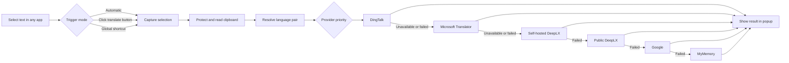

# Selection Translator

> A global selection translation utility for macOS, Windows, and Linux. Select text anywhere, press a shortcut or click the floating translate button, and read the translation without leaving your current application.

[](https://www.electronjs.org/)
[](https://www.electronjs.org/)
[](https://www.typescriptlang.org/)
[](./package.json)

**Version: `0.1.0`** · **Current UI language: Simplified Chinese**

**English** · [简体中文](./README.zh-CN.md)

---

## Table of Contents

- [Overview](#overview)
- [Features](#features)
- [Screenshots](#screenshots)
- [How It Works](#how-it-works)
- [Download and Install](#download-and-install)
- [Development Requirements](#development-requirements)
- [Run Locally](#run-locally)
- [Grant Accessibility Permission](#grant-accessibility-permission)
- [Quick Start](#quick-start)
- [Configuration](#configuration)
- [Translation Providers and Fallback](#translation-providers-and-fallback)
- [Configure Self-hosted DeepLX](#configure-self-hosted-deeplx)
- [Configure DingTalk Enterprise Translation](#configure-dingtalk-enterprise-translation)
- [Configure Microsoft Translator](#configure-microsoft-translator)
- [Privacy and Security](#privacy-and-security)
- [Project Structure](#project-structure)
- [Development, Testing, and Packaging](#development-testing-and-packaging)
- [Troubleshooting](#troubleshooting)
- [Known Limitations](#known-limitations)
- [Roadmap](#roadmap)
- [Contributing](#contributing)
- [Friendly Links](#friendly-links)
- [License](#license)

## Overview

Selection Translator is a desktop productivity utility for macOS, Windows, and Linux that lives in the system menu bar or tray. It translates selected text in place, so you do not need to copy content into a browser, switch applications, or open a separate translation page.

The app uses system-level selection monitoring and a controlled copy-based capture flow to read selected text from the frontmost application, then displays a lightweight floating translation popup near the selection.

Typical use cases include:

- Reading English websites, technical documentation, papers, and PDFs;
- Looking up words or short phrases in an IDE, terminal, Office app, or chat client;
- Reviewing translations repeatedly without leaving the current workflow;
- Using Microsoft Translator, a self-hosted DeepLX service, or an enterprise DingTalk translation application.

## Features

- **Global text selection translation** for applications that support normal system copy operations.
- **Three trigger modes**:
  - **Translate automatically** after a selection is detected;
  - **Show a floating button** and translate only after clicking `译`;
  - **Shortcut only**, without reacting to mouse selections.
- **Floating translation popup** with the original text, translation, language direction, and the provider actually used.
- **Pinning support** so the popup stays open when clicking outside or when auto-hide is enabled.
- **Configurable auto-hide**: disabled, 3, 5, 8, or 15 seconds.
- **Automatic Chinese/English direction**: Chinese text defaults to English; other text defaults to Chinese when the target language is set to automatic mode.
- **Manual source and target language selection** with a built-in list of 29 languages.
- **Provider fallback** across DingTalk, Microsoft Translator, self-hosted DeepLX, public DeepLX, Google, and MyMemory.
- **Translation cache and circuit breaker** to reuse successful results and temporarily skip failing providers.
- **Clipboard protection** that preserves existing text or image content whenever possible and avoids overwriting a newer user copy action.
- **Proxy configuration** for system proxy, direct connection, or custom HTTP/HTTPS/SOCKS4/SOCKS5 proxy rules.
- **DingTalk enterprise translation integration** with configuration checks and encrypted ClientSecret storage.
- **Microsoft Translator integration** through the Bing web translator flow, with no Azure account, subscription key, or region required.
- **Self-hosted DeepLX integration** with endpoint health checks and a generated Docker command.
- **Light and dark appearance** following the operating system color scheme.
- **Menu-bar controls** for languages, settings, and quitting the application.

## Screenshots

The following screenshots show the selection translation workflow, the translation result popup, the tabbed settings interface, Microsoft Translator configuration, and the menu-bar/tray controls.

### Selection translation

<p align="center">
  
</p>

### Translation result

<p align="center">
  
</p>

### General settings

<p align="center">
  
</p>

### Microsoft Translator settings

<p align="center">
  
</p>

### Menu-bar/tray menu

<p align="center">
  
</p>

## How It Works



## Download and Install

### Option 1: One-click install (recommended)

The installer detects the operating system and CPU architecture, downloads the matching GitHub Release asset, downloads and verifies `SHA256SUMS`, installs the application, and creates a default local configuration. It only writes to the current user's directories and does not require administrator privileges.

**Linux / macOS:**

```bash
curl -fsSL \
  https://raw.githubusercontent.com/zhq734/translation/master/scripts/install.sh \
  | sh
```

**Windows PowerShell:**

```powershell
irm https://raw.githubusercontent.com/zhq734/translation/master/scripts/install.ps1 | iex
```

Pin a version with `SELECTION_TRANSLATOR_VERSION` (with or without the `v` prefix). For compatibility with existing one-click commands, `GROKBUILD_VERSION` is also accepted. If the project moves to another GitHub repository, set `SELECTION_TRANSLATOR_REPOSITORY=owner/repository`:

```bash
curl -fsSL https://raw.githubusercontent.com/zhq734/translation/master/scripts/install.sh \
  | SELECTION_TRANSLATOR_VERSION=v0.2.0 sh
```

```powershell
$env:SELECTION_TRANSLATOR_VERSION = 'v0.2.0'
irm https://raw.githubusercontent.com/zhq734/translation/master/scripts/install.ps1 | iex
```

The compatibility variable can also pin the version directly:

```bash
curl -fsSL https://raw.githubusercontent.com/zhq734/translation/master/scripts/install.sh \
  | GROKBUILD_VERSION=v0.2.0 sh
```

```powershell
$env:GROKBUILD_VERSION = 'v0.2.0'
irm https://raw.githubusercontent.com/zhq734/translation/master/scripts/install.ps1 | iex
```

Linux installs an AppImage at `~/.local/bin/selection-translator` and creates a desktop entry. macOS installs to `~/Applications` by default. Windows silently runs the NSIS installer and creates Start Menu/desktop shortcuts. macOS still requires Accessibility permission on first launch.

### Option 2: Download a GitHub Release

For manual installation, download the matching asset from GitHub [Releases](../../releases):

- **macOS**: `SelectionTranslator-<version>-mac-<arch>.zip` or `.dmg`;
- **Linux**: use `SelectionTranslator-<version>-linux-x86_64.AppImage` for x64 or `SelectionTranslator-<version>-linux-arm64.AppImage` for ARM64;
- **Windows**: `SelectionTranslator-<version>-Setup-<arch>.exe`.

Publish `SHA256SUMS` alongside the installers in the same Release. Both `x64` and `arm64` are supported; see [Development, Testing, and Packaging](#development-testing-and-packaging).

### In-app update checks and upgrades

- Packaged builds silently check GitHub Releases about five seconds after startup, but never download or install an update without user confirmation;
- Open **Settings → About** to view the current version, check manually, monitor download progress, and restart into a downloaded update;
- Windows NSIS builds support in-app download and restart installation. Linux supports automatic replacement only when running as an AppImage; other Linux installations open the GitHub Release page;
- On macOS, automatic installation is enabled only when the `.app` passes code-signature verification. The current unsigned builds safely fall back to opening GitHub Releases for manual installation;
- Source development mode does not access the update service. The Release-page fallback remains available after check or download failures.

> The already-published `V1.0.3` release does not contain the updater code or the required `latest*.yml` / `.blockmap` metadata, so users of that version must manually install the first release containing this feature. Subsequent releases must upload installers, updater metadata, differential files, and `SHA256SUMS` together. Prefer lowercase tags such as `v1.0.4`.

### Option 3: Run from Source

```bash
git clone https://github.com/zhq734/translation.git
cd translation
npm install
npm run dev
```

> After a fork or repository migration, update the Raw URLs in the one-click commands or set `SELECTION_TRANSLATOR_REPOSITORY=owner/repository` to override the installer Release source.

## Development Requirements

| Item | Requirement |
| --- | --- |
| Operating system | macOS, Windows 10/11, or Linux; use matching build hosts for release artifacts |
| Node.js | `>= 18`; Node.js 20 or later is recommended |
| Package manager | npm |
| Desktop framework | Electron 33 |
| Build tools | electron-vite, Vite, electron-builder |
| Language | TypeScript 5.x |
| Native dependency | `uiohook-napi` for global mouse and keyboard events |

If `uiohook-napi` needs to be rebuilt locally, install the native build toolchain required by your Node/Electron architecture.

## Run Locally

```bash
# Development mode
npm run dev

# Preview the built renderer output
npm run preview

# Type-check the project
npm run typecheck

# Run unit tests
npm test
```

The app does not open a conventional main window. After startup, it stays in the system menu bar or tray. Click the `译` icon to change languages or open settings.

## Grant Accessibility Permission

Selection capture requires macOS Accessibility permission. The app uses a controlled system-level `Command+C` simulation to read selected text from the frontmost application.

1. Open **System Settings → Privacy & Security → Accessibility**;
2. Add and enable `划词翻译`;
3. When running in development mode, add and enable `Electron`;
4. Quit and relaunch the app completely;
5. Select text again to verify the setup.

Without this permission, the app cannot reliably read selected text from other applications. Automatic mode and manual triggers will show a permission hint and try to open the relevant macOS settings page.

## Quick Start

### Selection button mode (default)

1. Select text in an application that supports normal copy operations;
2. Wait for the `译` button near the upper-right side of the selection;
3. Click the button;
4. Read the result in the floating popup.

### Automatic translation mode

Open settings and change the trigger mode to **Translate automatically after selection**. Every valid selection will open the popup and start translation immediately.

### Global shortcut mode

The default shortcut is `Alt+T`. On macOS, `Alt` maps to the `Option（⌥）` key:

```text
Select text → press Option + T（⌥T）
```

The shortcut can be changed in settings. Do not use `Command+C` or `Control+C` as the translation shortcut; the app rejects system copy shortcuts to avoid interfering with normal copy behavior.

### Popup controls

- **Pin**: pin or unpin the popup;
- **Copy**: copy the current translation to the system clipboard;
- **Language selectors**: change the source/target preference and translate again;
- **Settings**: open the settings window;
- **Close**: close the popup with `×` or `Esc`.

## Configuration

Settings are saved automatically and take effect immediately.

| Setting | Description | Default |
| --- | --- | --- |
| Target language | Fixed target language or automatic Chinese/English translation | Automatic Chinese/English |
| Source language | Fixed source language or automatic detection | Automatic detection |
| Trigger mode | Automatic, selection button, or shortcut only | Selection button |
| Global shortcut | Electron accelerator such as `Alt+T` or `Cmd+Shift+Y` | `Alt+T` |
| Auto-hide | 0, 3, 5, 8, or 15 seconds | Disabled |
| Proxy mode | System proxy, direct connection, or custom proxy | System proxy |
| Self-hosted DeepLX | DeepLX `/translate` endpoint; empty means disabled | Not configured |
| DingTalk translation | Enterprise translation provider | Disabled |
| Microsoft Translator | Key-free Bing web translator channel | Disabled |

### Configuration files

Public settings are stored in Electron's `userData` directory. The directory is typically:

```text
# Development mode
~/Library/Application Support/selection-translator/settings.json

# Packaged app (using productName as the directory name)
~/Library/Application Support/划词翻译/settings.json
```

The DingTalk `ClientSecret` is stored separately in the same `userData` directory:

```text
~/Library/Application Support/<userData>/credentials.json
```

Microsoft translation does not store a subscription credential because the Bing web translator flow does not require an Azure key or region.

Settings are migrated between versions using `schemaVersion`. Quit the application and back up the original file before editing settings manually.

## Translation Providers and Fallback

Translation requests are attempted in this order:

| Priority | Provider | Enabled when | Notes |
| ---: | --- | --- | --- |
| 1 | DingTalk | Enabled, fully configured, and the language pair is supported | Enterprise provider; falls back automatically on failure |
| 2 | Microsoft Translator | Enabled and the language pair is supported | Uses temporary parameters obtained from the Bing translator page; no Azure key or region is required |
| 3 | Self-hosted DeepLX | An endpoint is configured | Recommended for stable personal or internal use |
| 4 | Public DeepLX | Always available as a default fallback | Free public service; may be rate-limited |
| 5 | Google | The Google translation endpoint is reachable | Unofficial endpoint; a proxy may be required |
| 6 | MyMemory | Earlier providers fail | Free fallback with provider-side limits |

The runtime also caches results by text and language pair, displays the active provider in the popup, and temporarily trips failing providers before retrying them after a cooldown. A single request processes at most 5,000 characters; Microsoft splits it into chunks of up to 1,000 characters, while Google and MyMemory are truncated further according to their own limits.

Availability, rate limits, quotas, and terms of public translation services can change. The Microsoft channel depends on an unofficial Bing web interface and automatically falls back when that interface is unavailable. For more predictable personal use, configure a self-hosted DeepLX instance.

## Configure Self-hosted DeepLX

Self-hosted DeepLX is the recommended option for a more stable setup. See the complete guide in [docs/deeplx-selfhost.md](docs/deeplx-selfhost.md).

Quick setup:

1. Prepare a free DeepL account;
2. Obtain `dl_session` according to the DeepLX documentation;
3. Start DeepLX locally with Docker;
4. Enter the service address under **Self-hosted DeepLX** in the app settings;
5. Click **Check availability**.

Example:

```bash
docker run -d \
  --name deeplx \
  --restart unless-stopped \
  -p 1189:1188 \
  -e TOKEN=your_dl_session_value \
  ghcr.io/owo-network/deeplx:latest
```

Use the following endpoint in the app:

```text
http://127.0.0.1:1189/translate
```

> Treat `dl_session` as a sensitive credential. Never commit it to Git or expose it in screenshots or public chats. DeepLX depends on an upstream web service and may temporarily break after upstream changes; follow the official DeepLX project for current instructions.

## Configure DingTalk Enterprise Translation

DingTalk translation is intended for enterprise internal applications with the **AI Text Translation** permission enabled.

1. Create an enterprise internal application in the DingTalk Open Platform;
2. Grant the **AI Text Translation** permission;
3. Prepare the application `CorpId`, `ClientId`, and `ClientSecret`;
4. Open **划词翻译 → 设置…**;
5. Enable DingTalk translation and enter the public configuration;
6. Click **保存钉钉配置**;
7. Click **检测配置** to verify the Token and text translation flow.

Security behavior:

- `ClientSecret` is sent from the settings page to the Electron main process only;
- Electron `safeStorage` encrypts it before it is written to `credentials.json`;
- `settings.json`, renderer settings snapshots, and logs do not store or display the plaintext Secret;
- Leaving the Secret field empty preserves the existing credential;
- Use **清除 Secret** to explicitly remove it;
- Incomplete configuration, unsupported language pairs, permission errors, rate limits, and network failures automatically fall back to other providers.

## Configure Microsoft Translator

Microsoft translation uses the Bing web translator flow and requires no Azure account, subscription key, or region.

1. Open **划词翻译 → 设置…**;
2. Select **微软翻译**;
3. Enable the channel;
4. Click **检测可用性** to verify that the current network can access Bing translation.

Runtime behavior:

- The app first loads the Bing translator page and extracts its short-lived anti-abuse parameters;
- Translation requests are then sent to the Bing web translator endpoint through the app's configured network session;
- Short-lived parameters are cached only in memory, refreshed automatically, and never written to a credential file;
- Expired web sessions are cleared and retried once;
- Enabling or disabling the channel clears Microsoft-related cached results, short-lived authentication state, and circuit-breaker state;
- Authentication, rate-limit, parameter, service, and network failures are sanitized and automatically fall back to later providers.

> This is an unofficial web interface, not a Microsoft-supported public developer API. Bing page structure or anti-abuse changes may break it without notice. Keep fallback providers enabled, and use Azure Translator or another official API in applications that require a service-level stability commitment.

## Privacy and Security

The data flow is:

1. On macOS the app uses Accessibility and a controlled `Command+C`; on Windows it uses a controlled `Ctrl+C`; on Linux it reads the primary selection;
2. The selected text is sent to the provider selected by the fallback chain;
3. When self-hosted DeepLX is configured, the request can stay on your machine, LAN, or private server;
4. If an earlier provider is unavailable, the app may continue with Microsoft Translator, self-hosted/public DeepLX, Google, or MyMemory according to the configured priority;
5. The translation is shown locally in the popup and is copied only when the user chooses to copy it.

Do not use the app to translate passwords, API keys, customer data, unreleased source code, or other sensitive content without first assessing the provider and deployment you selected.

This project does not provide a cloud account system. DingTalk credentials are used only when that provider is enabled and configured; the Secret is persisted only in a separate `safeStorage`-encrypted credential file and never written in plaintext to public settings. Microsoft translation stores only its enabled state in public settings; temporary Bing web parameters remain in memory and are not user credentials.

## Project Structure

```text
.
├── README.md                         # Default English documentation
├── README.zh-CN.md                   # Simplified Chinese documentation
├── src/
│   ├── main/                         # Electron main process
│   │   ├── index.ts                  # App lifecycle, tray, IPC, shortcuts, orchestration
│   │   ├── capture.ts                # Selection capture and clipboard restoration
│   │   ├── translate.ts              # Providers, cache, breaker, fallback
│   │   ├── network.ts                # Dedicated translation session and proxy
│   │   ├── autoTrigger.ts            # Global mouse/keyboard monitoring
│   │   ├── selectionButton.ts        # Floating selection button
│   │   ├── popup.ts                  # Translation popup window
│   │   ├── settings.ts               # Settings persistence and normalization
│   │   ├── dingtalkConfig.ts         # DingTalk configuration orchestration
│   │   ├── dingtalkCredentials.ts    # Encrypted safeStorage credentials
│   │   ├── dingtalkTokenManager.ts   # DingTalk OAuth token management
│   │   ├── dingtalkTranslation.ts    # DingTalk translation adapter
│   │   ├── microsoftErrors.ts        # Sanitized Microsoft error classification
│   │   ├── microsoftLanguage.ts      # Microsoft language-code adaptation
│   │   └── microsoftTranslation.ts   # Key-free Bing web translator adapter
│   ├── preload/                      # Secure contextBridge IPC bridge
│   ├── renderer/                     # Popup, selection button, and settings UI
│   └── shared/                       # Types, languages, proxy and interaction rules
├── tests/                            # Node.js built-in tests and TypeScript tests
├── docs/                             # Deployment and operational documentation
├── scripts/run-tests.mjs             # Test bundling and execution
├── scripts/install.sh                 # Linux/macOS one-click installer
├── scripts/install.ps1                # Windows PowerShell one-click installer
├── scripts/generate-checksums.mjs     # Release SHA-256 manifest generator
├── electron.vite.config.ts           # Multi-entry Electron/Vite configuration
├── package.json                      # Scripts, dependencies, and packaging config
└── tsconfig.json                     # TypeScript configuration
```

## Development, Testing, and Packaging

### Common commands

```bash
# Install dependencies
npm install

# Run in development mode
npm run dev

# Type-check
npm run typecheck

# Run unit tests
npm test

# Build into out/
npm run build

# Build macOS x64/arm64 .app + .dmg + .zip
npm run dist:mac

# Build macOS x64/arm64 DMG packages
npm run dist:dmg

# Build Linux x64/arm64 AppImage packages
npm run dist:linux

# Build Windows x64/arm64 NSIS installers
npm run dist:win

# Generate SHA256SUMS for release installers
npm run release:checksums
```

### Build outputs

- `npm run build` generates main, preload, and renderer outputs in `out/`;
- `npm run dist:mac` creates macOS x64/arm64 `dmg` and `zip` packages;
- `npm run dist:linux` creates Linux x64/arm64 AppImage packages; the x64 artifact uses `x86_64` in its file name;
- `npm run dist:win` creates `SelectionTranslator-<version>-Setup-<arch>.exe` NSIS installers;
- Every platform package creates a `latest*.yml` update manifest. macOS and Windows also create standalone `.blockmap` files, while Linux AppImage embeds its differential block data;
- `npm run release:checksums` creates `SHA256SUMS` for `.AppImage`, `.dmg`, `.zip`, and `.exe` files; upload it alongside all installers in the same Release;
- All packaged files are written to `dist/`;
- Platform packaging commands explicitly use `--publish never`, so electron-builder only creates local artifacts and cannot implicitly publish during a tag build;
- Install-test each target package on a matching real device before release. Cross-building may download target Electron, NSIS, or AppImage toolchains.

### GitHub Actions Multi-Platform Packaging

The repository includes `.github/workflows/package.yml`. Run it manually from **Actions → Multi-Platform Packaging → Run workflow**. An optional version such as `V1.0.3` can be supplied; otherwise, the version from `package.json` is used.

The workflow runs unit tests and type checking first, then builds x64/arm64 installers on native macOS, Windows, and Linux runners and uploads the platform artifacts to the workflow run. Pushing a version tag beginning with `v` or `V` also performs the release flow automatically:

1. Synchronize the package version from the tag;
2. Collect installers from all three platforms;
3. Generate `SHA256SUMS`;
4. Create new Releases as drafts, upload installers, `latest*.yml`, `.blockmap`, and checksums, then publish only after every asset is available so clients never observe an incomplete update.

Prefer lowercase version tags. For example, to publish `v1.0.4`:

```bash
git tag v1.0.4
git push origin v1.0.4
```

### Testing

The project uses Node.js's built-in test runner. `scripts/run-tests.mjs` bundles TypeScript test entries with esbuild into a temporary directory and then executes them. Tests cover selection gestures, trigger modes, shortcut protection, clipboard text/image preservation, language resolution, settings migration, proxy handling, DingTalk authentication and encrypted credential storage, Bing page-parameter parsing and Microsoft fallback behavior, and provider settings UI contracts.

Before submitting a change, run:

```bash
npm test && npm run typecheck && npm run build
```

## Troubleshooting

### No selection button or translation result

- Grant Accessibility permission;
- Make sure the trigger mode is not set to shortcut-only;
- Use the configured shortcut when shortcut-only mode is enabled;
- Quit old app processes completely and relaunch;
- Some applications use custom-rendered controls or do not support normal system copy, so selection capture may not work.

### `npm install` fails

- Confirm Node.js is version 18 or newer;
- Remove an incomplete dependency installation and retry `npm install`;
- Install Xcode Command Line Tools if a native module must be compiled;
- If npm cache permissions are broken, use a project-local cache:

  ```bash
  npm install --cache ./.npm-cache
  ```

### Translation fails or returns `429`

Public DeepLX may be rate-limited and Google may be blocked by the current network. The app automatically tries later providers. For a more stable setup, configure [self-hosted DeepLX](#configure-self-hosted-deeplx) and verify that the local endpoint is online.

### Self-hosted DeepLX health check fails

- Verify that the Docker container is running;
- Check whether the port is already in use;
- Include the `/translate` path in the configured URL;
- When using a proxy, bypass `localhost`, `127.0.0.1`, and `<local>` for a local DeepLX instance;
- Call the endpoint with `curl` directly to separate app issues from service/network issues.

### macOS blocks the unsigned app

The current packaging configuration does not include code signing or notarization. On first launch, right-click the app in Finder and choose **Open**, or allow it under **System Settings → Privacy & Security**. For public distribution, configure Apple Developer signing and notarization.

### DingTalk Secret cannot be saved

When Electron `safeStorage` is unavailable, the app refuses to write a plaintext credential. Check that the system keychain/security storage is available, relaunch the app, and configure the Secret again. Never put the Secret into `settings.json` manually.

### Microsoft availability check fails

- No Azure subscription key or region is required; do not create or paste one for this channel;
- Verify that the current network and proxy can access `www.bing.com`;
- Retry later if Bing rejects the temporary web session or rate-limits requests;
- Keep DeepLX, Google, or MyMemory available so the runtime can fall back automatically;
- If Bing changes its page or anti-abuse behavior, this unofficial integration may require an application update.

## Known Limitations

- macOS remains the primary runtime validation platform. Linux AppImage and Windows NSIS packaging are available, but global selection, permissions, and shortcuts should be verified on real target hardware before release;
- The in-app UI is currently Simplified Chinese; English `README.md` and Simplified Chinese `README.zh-CN.md` are maintained separately;
- Selection capture depends on normal system copy behavior and may not work in custom-rendered, remote-desktop, or restricted applications;
- Translation depends on network access and third-party providers, including DingTalk, Microsoft Translator, DeepLX, Google, and MyMemory; the Microsoft channel specifically uses an unofficial Bing web interface that may change or stop working without notice;
- A single input is limited to 5,000 processed characters, with shorter limits for some fallback providers;
- Current packages are unsigned: macOS notarization and Windows code signing are not configured;
- No account system or cloud sync is included. Automatic updates depend on GitHub Release metadata; unsigned macOS builds and non-AppImage Linux builds fall back to manual installation.

## Roadmap

Potential future directions include:

- English and additional in-app UI localizations;
- More configurable providers and richer provider health status;
- Better capture support through the macOS Accessibility API;
- Improve signing, notarization, differential-update validation, and release monitoring;
- Improve Windows and Linux runtime validation, code signing, and automated releases.

## Contributing

Issues, feature requests, documentation improvements, and pull requests are welcome.

Recommended workflow:

1. Fork the project and create a focused branch;
2. Add or update tests before implementing new behavior;
3. Keep strict TypeScript checks passing;
4. Never commit real DingTalk credentials, DeepLX tokens, personal settings, or build caches;
5. Run:

   ```bash
   npm test && npm run typecheck && npm run build
   ```

6. Describe the change, test results, and compatibility considerations in the pull request.

The project convention is to write code comments in Simplified Chinese and mark new or modified comment authors as `zhenghq`.

## Friendly Links

- [LINUX DO](https://linux.do/) — This project is shared in the community.

## License

This project is released under the [MIT License](./package.json). Third-party translation providers, DeepLX, the DingTalk Open Platform, and their APIs are subject to their own terms of service and licenses.

---

## Maintenance Note

Keep commands, directories, and feature descriptions in `README.md` and `README.zh-CN.md` aligned with `package.json`, `src/`, `tests/`, and `docs/`. When adding providers, changing permission behavior, modifying packaging targets, or altering credential storage, update both language files in the same change.
