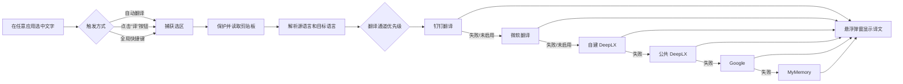

# 划词翻译 · Selection Translator

> 一款支持 macOS、Windows 与 Linux 的全局划词翻译工具。选中文字，使用快捷键或选区旁的“译”按钮，即可在当前内容附近查看译文。

[](https://www.electronjs.org/)
[](https://www.electronjs.org/)
[](https://www.typescriptlang.org/)
[](./package.json)

**版本：`0.1.0`** · **当前界面语言：简体中文**

[English](./README.md) · **简体中文**

---

## 目录

- [产品简介](#产品简介)
- [核心能力](#核心能力)
- [界面截图](#界面截图)
- [工作流程](#工作流程)
- [下载安装](#下载安装)
- [开发环境](#开发环境)
- [运行项目](#运行项目)
- [首次授权：辅助功能](#首次授权辅助功能)
- [快速使用](#快速使用)
- [设置说明](#设置说明)
- [翻译通道与降级策略](#翻译通道与降级策略)
- [配置自建 DeepLX](#配置自建-deeplx)
- [配置钉钉企业翻译](#配置钉钉企业翻译)
- [配置微软翻译](#配置微软翻译)
- [隐私与安全](#隐私与安全)
- [项目结构](#项目结构)
- [开发、测试与打包](#开发测试与打包)
- [常见问题](#常见问题)
- [已知限制](#已知限制)
- [参与贡献](#参与贡献)
- [友情链接](#友情链接)
- [许可证](#许可证)

## 产品简介

划词翻译是一款面向 macOS、Windows 与 Linux 的桌面效率工具，常驻系统菜单栏或托盘，不需要复制、切换浏览器或打开独立翻译网页。它通过系统级选区监听和受控的复制取词流程，获取当前应用中的选中文字，并在选区附近显示轻量翻译弹窗。

适合以下场景：

- 阅读英文网页、技术文档、论文和 PDF；
- 在 IDE、终端、Office、即时通讯工具中快速理解单词或短句；
- 需要在不离开当前工作流的情况下反复查看译文；
- 希望使用微软翻译、自建 DeepLX 或企业内部钉钉翻译服务的个人和团队。

## 核心能力

- **全局划词翻译**：支持浏览器、Office、PDF、聊天软件等支持系统复制的应用。
- **三种触发模式**：
  - **自动翻译**：完成划词后直接打开弹窗并开始翻译；
  - **选区按钮**：完成划词后显示“译”按钮，点击后才翻译；
  - **仅快捷键**：划词不自动响应，仅通过全局快捷键触发。
- **轻量悬浮弹窗**：显示原文、译文、语言方向和实际使用的翻译通道。
- **弹窗固定**：点击图钉后，弹窗不会因点击外部或自动隐藏计时而关闭。
- **自动隐藏**：可选择不自动隐藏，或在 3、5、8、15 秒后关闭。
- **语言自动适配**：目标语言为“自动中英互译”时，中文默认翻译为英文，其他文本默认翻译为中文；也支持手动指定源语言和目标语言。
- **多语言支持**：内置中文、英语、日语、韩语、法语、德语、西班牙语、葡萄牙语、意大利语、荷兰语、波兰语、俄语、土耳其语、印尼语、乌克兰语、阿拉伯语、瑞典语、丹麦语、捷克语、希腊语、芬兰语、匈牙利语、罗马尼亚语、斯洛伐克语、保加利亚语、立陶宛语、拉脱维亚语、爱沙尼亚语和斯洛文尼亚语。
- **多通道自动降级**：钉钉翻译、微软翻译、自建 DeepLX、公共 DeepLX、Google 和 MyMemory 按优先级尝试；当前通道失败或熔断时自动切换后续通道。
- **翻译缓存与熔断**：相同文本和语言设置会优先读取缓存；失败通道进入冷却期，避免连续请求拖慢后续划词。
- **剪贴板保护**：取词前保存剪贴板，取词完成后尽量恢复原文本或图片；如果用户在取词期间主动复制，则不覆盖用户的新内容。
- **网络代理**：支持跟随系统代理、直连、自定义 HTTP/HTTPS/SOCKS4/SOCKS5 代理和绕过规则。
- **钉钉企业翻译**：可接入企业内部应用，支持 CorpId、ClientId、ClientSecret 配置、在线检测和显式清除凭证。
- **微软翻译**：通过 Bing 网页翻译链路提供免配置能力，无需 Azure 账号、订阅密钥或 Region，并支持在线检测。
- **自建 DeepLX**：支持填写自建服务地址，并提供在线检测和 Docker 部署命令生成。
- **明暗主题**：渲染界面跟随操作系统的浅色/深色外观。
- **菜单栏/托盘常驻**：可快速切换源语言、目标语言、打开设置或退出应用。

## 界面截图

以下截图展示选区翻译流程、翻译结果弹窗、标签页式设置界面、微软翻译通道设置和菜单栏/托盘控制菜单。

### 选区翻译

<p align="center">
  
</p>

### 翻译结果

<p align="center">
  
</p>

### 常规设置

<p align="center">
  
</p>

### 微软翻译设置

<p align="center">
  
</p>

### 菜单栏/托盘菜单

<p align="center">
  
</p>

## 工作流程



## 下载安装

### 方式一：一键安装（推荐）

安装脚本会自动识别操作系统与 CPU 架构，从 GitHub Releases 下载对应安装包，下载 `SHA256SUMS` 并验证 SHA-256，然后安装应用并生成默认本地配置。脚本只写入当前用户目录，不要求管理员权限。

**Linux / macOS：**

```bash
curl -fsSL \
  https://raw.githubusercontent.com/zhq734/translation/master/scripts/install.sh \
  | sh
```

**Windows PowerShell：**

```powershell
irm https://raw.githubusercontent.com/zhq734/translation/master/scripts/install.ps1 | iex
```

如需固定版本，可设置 `SELECTION_TRANSLATOR_VERSION`（支持带或不带 `v` 前缀）。为兼容既有一键安装命令，也接受 `GROKBUILD_VERSION`。如项目迁移到其他 GitHub 仓库，可设置 `SELECTION_TRANSLATOR_REPOSITORY=owner/repository`：

```bash
curl -fsSL https://raw.githubusercontent.com/zhq734/translation/master/scripts/install.sh \
  | SELECTION_TRANSLATOR_VERSION=v0.2.0 sh
```

```powershell
$env:SELECTION_TRANSLATOR_VERSION = 'v0.2.0'
irm https://raw.githubusercontent.com/zhq734/translation/master/scripts/install.ps1 | iex
```

兼容命名也可以直接固定版本：

```bash
curl -fsSL https://raw.githubusercontent.com/zhq734/translation/master/scripts/install.sh \
  | GROKBUILD_VERSION=v0.2.0 sh
```

```powershell
$env:GROKBUILD_VERSION = 'v0.2.0'
irm https://raw.githubusercontent.com/zhq734/translation/master/scripts/install.ps1 | iex
```

Linux 会安装 AppImage 到 `~/.local/bin/selection-translator` 并创建桌面入口；macOS 默认安装到 `~/Applications`；Windows 会静默运行 NSIS 安装程序并创建开始菜单/桌面快捷方式。macOS 首次启动仍需在“系统设置 → 隐私与安全性 → 辅助功能”中授权。

### 方式二：下载 GitHub Release

如果需要手动安装，可在 GitHub 的 [Releases](../../releases) 页面下载对应系统的文件：

- **macOS**：下载 `SelectionTranslator-<版本>-mac-<架构>.zip` 或 `.dmg`，打开后将“划词翻译”拖入 `Applications`；
- **Linux**：x64 下载 `SelectionTranslator-<版本>-linux-x86_64.AppImage`，ARM64 下载 `SelectionTranslator-<版本>-linux-arm64.AppImage`，添加执行权限后运行；
- **Windows**：下载 `SelectionTranslator-<版本>-Setup-<架构>.exe`，运行安装向导。

所有安装包应与同一 Release 中的 `SHA256SUMS` 一起发布。当前支持 `x64` 与 `arm64`，详见[开发、测试与打包](#开发测试与打包)。

### 方式三：从源码运行

```bash
# 克隆项目
git clone https://github.com/zhq734/translation.git
cd translation

# 安装依赖
npm install

# 启动 Electron 开发模式
npm run dev
```

> Fork 或迁移仓库后，请同步修改一键安装命令中的 Raw URL，或通过 `SELECTION_TRANSLATOR_REPOSITORY=owner/repository` 覆盖安装脚本的 Release 来源。

## 开发环境

| 项目 | 要求 |
| --- | --- |
| 操作系统 | macOS、Windows 10/11 或 Linux；发布跨平台安装包建议使用对应平台构建机 |
| Node.js | `>= 18`，建议使用 Node.js 20 或更高版本 |
| 包管理器 | npm |
| 桌面框架 | Electron 33 |
| 构建工具 | electron-vite、Vite、electron-builder |
| 编程语言 | TypeScript 5.x |
| 原生依赖 | `uiohook-napi`，用于全局鼠标和键盘事件监听 |

如果 `uiohook-napi` 在本机需要重新编译，请确保本机已安装适用于 Node/Electron 原生模块的编译工具链。

## 运行项目

```bash
# 开发模式：启动 Electron + Vite
npm run dev

# 预览已构建的渲染产物
npm run preview

# TypeScript 类型检查
npm run typecheck

# 执行单元测试
npm test
```

启动成功后，应用不会显示传统主窗口，而是常驻系统菜单栏或托盘。点击“译”图标即可打开语言切换和设置菜单。

## 首次授权：辅助功能

划词取词依赖 macOS 的“辅助功能”权限。应用会通过系统级方式模拟 `Command+C`，读取当前前台应用的选中文字，因此首次使用前必须授权。

1. 打开 **系统设置 → 隐私与安全性 → 辅助功能**；
2. 在列表中添加并勾选“划词翻译”；
3. 如果使用开发模式，请添加并勾选 `Electron`；
4. 完全退出并重新启动应用；
5. 再次选中文字进行测试。

如果没有权限：

- 自动翻译模式启动时会主动提示并尝试打开系统设置页面；
- 手动触发失败时，翻译弹窗会显示授权提示；
- 未授权时无法稳定读取其他应用中的选中文字。

## 快速使用

### 方式一：选区按钮（默认）

1. 在任意支持复制文本的应用中选中文字；
2. 等待选区右上角出现“译”按钮；
3. 点击“译”按钮；
4. 在悬浮弹窗中查看翻译结果。

### 方式二：自动翻译

在设置中将“触发方式”改为“划词后自动打开并翻译”。之后完成选词即可直接打开翻译弹窗。

### 方式三：全局快捷键

默认快捷键为 `Alt+T`。在 macOS 上，`Alt` 对应键盘上的 `Option（⌥）`，因此默认操作是：

```text
选中文字 → 按 Option + T（⌥T）
```

快捷键可在设置中修改。不要将 `Command+C`、`Control+C` 等系统复制快捷键设置为翻译快捷键，应用会拒绝注册这些组合，避免干扰正常复制。

### 弹窗操作

- **图钉**：固定或取消固定弹窗；
- **复制**：将当前译文写入系统剪贴板；
- **语言选择器**：临时修改源语言和目标语言并重新翻译；
- **齿轮**：打开设置窗口；
- **关闭**：点击“×”或按 `Esc` 关闭弹窗。

## 设置说明

设置窗口支持修改后自动保存并立即生效。

| 设置项 | 说明 | 默认值 |
| --- | --- | --- |
| 目标语言 | 选择固定目标语言，或使用自动中英互译 | 自动中英互译 |
| 源语言 | 选择固定源语言，或自动检测 | 自动检测 |
| 触发方式 | 自动翻译、选区按钮、仅快捷键 | 选区按钮 |
| 全局快捷键 | Electron accelerator 格式，例如 `Alt+T`、`Cmd+Shift+Y` | `Alt+T` |
| 结果自动隐藏 | 选择 0、3、5、8 或 15 秒 | 不自动隐藏 |
| 代理模式 | 系统代理、直连、自定义代理 | 跟随系统代理 |
| 自建 DeepLX | DeepLX `/translate` 服务地址，留空表示关闭 | 未配置 |
| 钉钉翻译 | 企业内部应用翻译通道 | 关闭 |
| 微软翻译 | 免密钥的 Bing 网页翻译通道 | 关闭 |

### 配置文件位置

公开设置保存在 Electron 的 `userData` 目录中。根据运行方式，目录名通常为：

```text
# 开发模式
~/Library/Application Support/selection-translator/settings.json

# 打包应用（以 productName 为目录名）
~/Library/Application Support/划词翻译/settings.json
```

钉钉 `ClientSecret` 会单独存放在同一个 `userData` 目录下：

```text
~/Library/Application Support/<userData>/credentials.json
```

微软翻译不需要 Azure 密钥或 Region，因此不会创建微软订阅凭证文件。

不同版本的设置会通过 `schemaVersion` 自动迁移。修改设置文件前请先退出应用，并建议备份原文件。

## 翻译通道与降级策略

翻译请求默认按以下顺序执行：

| 优先级 | 通道 | 启用条件 | 说明 |
| ---: | --- | --- | --- |
| 1 | 钉钉翻译 | 已启用、配置完整、语言对受支持 | 企业内部应用通道；失败后自动降级 |
| 2 | 微软翻译 | 已启用、语言对受支持 | 从 Bing 翻译页面获取临时参数，无需 Azure 密钥或 Region |
| 3 | 自建 DeepLX | 设置了服务地址 | 推荐，适合长期个人使用或内网部署 |
| 4 | 公共 DeepLX | 始终作为默认兜底通道 | 免费公共服务，可能限流或不可用 |
| 5 | Google | 网络可访问 Google 翻译接口 | 使用非官方接口，部分网络需要代理 |
| 6 | MyMemory | 前面通道均失败 | 免费兜底，字符额度和质量受服务限制 |

运行时还会：

- 缓存相同文本、源语言和目标语言组合的结果；
- 在弹窗状态栏显示实际使用的翻译通道；
- 对失败通道执行临时熔断，冷却结束后自动恢复尝试；
- 单次输入最长处理 5000 个字符；微软通道会拆分为每段最多 1000 个字符，Google 和 MyMemory 通道会按各自限制进一步截断请求；
- 钉钉未启用、配置不完整、语言对不支持，或微软翻译未启用、语言对不支持时，不会产生对应网络请求。

公共翻译服务的可用性、限流、配额和服务条款可能随时变化。微软通道依赖非官方 Bing 网页接口，接口不可用时会自动降级。若需要更稳定的个人使用体验，建议部署自建 DeepLX。

## 配置自建 DeepLX

自建 DeepLX 是推荐的稳定方案。完整部署说明请查看：[docs/deeplx-selfhost.md](docs/deeplx-selfhost.md)。

快速流程：

1. 准备 DeepL 免费账号；
2. 按 DeepLX 官方说明获取 `dl_session`；
3. 使用 Docker 启动本地 DeepLX；
4. 在应用设置的“自建 DeepLX”中填入服务地址；
5. 点击“检测是否在线”。

示例部署命令：

```bash
docker run -d \
  --name deeplx \
  --restart unless-stopped \
  -p 1189:1188 \
  -e TOKEN=你的dl_session值 \
  ghcr.io/owo-network/deeplx:latest
```

然后在设置中填写：

```text
http://127.0.0.1:1189/translate
```

> `dl_session` 是敏感凭证，请不要提交到 Git、截图或公开聊天。DeepLX 依赖第三方网页服务，可能因上游改版而暂时失效；请以 DeepLX 官方项目说明为准。

## 配置钉钉企业翻译

钉钉翻译适用于已创建企业内部应用并开通 AI 文本翻译权限的账号。

1. 在钉钉开放平台创建企业内部应用；
2. 为应用开通 **AI 文本翻译** 权限；
3. 在应用设置中准备 `CorpId`、`ClientId` 和 `ClientSecret`；
4. 打开“划词翻译 → 设置…”；
5. 在“钉钉翻译”区域启用通道并填写公开配置；
6. 点击“保存钉钉配置”；
7. 点击“检测配置”，确认 Token 获取和文本翻译链路可用。

安全行为：

- `ClientSecret` 只通过设置页提交给 Electron 主进程；
- 使用 Electron `safeStorage` 加密后单独写入 `credentials.json`；
- 普通 `settings.json`、渲染进程设置快照和日志不会保存或显示明文 Secret；
- ClientSecret 输入框留空并保存其他字段时，会保留旧凭证；
- 如需删除凭证，必须点击“清除 Secret”；
- 配置不完整、语言不支持、权限不足、限流或网络失败时，会自动降级到其他翻译通道。

## 配置微软翻译

微软翻译通道使用 Bing 网页翻译链路，无需 Azure 账号、订阅密钥或 Region。

1. 打开“划词翻译 → 设置…”；
2. 进入“微软翻译”页签；
3. 打开“启用通道”；
4. 点击“检测可用性”，确认当前网络可以访问 Bing 翻译。

运行行为：

- 应用会先加载 Bing 翻译页面并提取短期防滥用参数；
- 随后通过应用当前配置的网络会话请求 Bing 网页翻译接口；
- 临时参数仅缓存在内存中，到期后自动刷新，不会写入凭证文件；
- 网页会话失效时会清理参数并自动重试一次；
- 启用状态变化后会清理微软相关翻译缓存、临时鉴权状态和熔断状态；
- 鉴权、限流、参数、服务或网络错误会经过脱敏，并自动降级到后续通道。

> 该能力使用的是非官方网页接口，并非微软承诺稳定的公开开发者 API。Bing 页面结构或反滥用策略调整都可能导致接口随时失效。建议保留后续兜底通道；需要服务稳定性承诺的正式业务，应改用 Azure Translator 或其他官方 API。

## 隐私与安全

请在使用前了解以下数据流：

1. macOS 通过辅助功能和受控 `Command+C` 读取选区，Windows 使用受控 `Ctrl+C`，Linux 读取 primary selection；
2. 选中文字会根据当前通道发送给对应的翻译服务；
3. 如果配置了自建 DeepLX，可将请求发送到你的本机、局域网或自有服务器；
4. 如果前序通道不可用，应用会按配置优先级继续请求微软翻译、自建/公共 DeepLX、Google 或 MyMemory；
5. 翻译结果会在本地弹窗中显示，并可由用户主动复制。

因此，不建议直接翻译密码、API Key、客户隐私、未公开源代码或其他敏感内容。使用第三方翻译服务时，请自行评估其隐私政策、数据保留、配额和服务条款。

本项目不提供云端账户系统。钉钉凭证仅在对应通道启用并完成配置后使用，Secret 只会持久化到独立的 `safeStorage` 加密文件中，不会以明文写入公开设置。微软翻译只在公开设置中保存启用状态，临时 Bing 网页参数仅保留在内存中，不属于用户凭证。

## 项目结构

```text
.
├── README.md                         # 默认英文文档
├── README.zh-CN.md                   # 简体中文文档
├── src/
│   ├── main/                         # Electron 主进程
│   │   ├── index.ts                  # 应用入口、托盘、IPC、快捷键与流程编排
│   │   ├── capture.ts                # 剪贴板取词、权限检测与剪贴板恢复
│   │   ├── translate.ts              # 翻译通道、缓存、熔断与降级策略
│   │   ├── network.ts                # 独立翻译网络会话与代理
│   │   ├── autoTrigger.ts            # 全局鼠标/键盘监听
│   │   ├── selectionButton.ts        # 选区旁“译”按钮
│   │   ├── popup.ts                  # 翻译悬浮窗
│   │   ├── settings.ts               # 设置持久化与规范化
│   │   ├── dingtalkConfig.ts         # 钉钉公开配置编排
│   │   ├── dingtalkCredentials.ts    # safeStorage 加密凭证存储
│   │   ├── dingtalkTokenManager.ts   # 钉钉 OAuth Token 管理
│   │   ├── dingtalkTranslation.ts    # 钉钉文本翻译适配器
│   │   ├── microsoftErrors.ts        # 微软错误分类与脱敏
│   │   ├── microsoftLanguage.ts      # 微软语言代码适配
│   │   └── microsoftTranslation.ts   # 免密钥 Bing 网页翻译适配器
│   ├── preload/                      # contextBridge 安全 IPC 桥接
│   ├── renderer/                     # 翻译弹窗、选区按钮与设置页面
│   └── shared/                       # 类型、语言、代理和交互规则
├── tests/                            # Node.js 内置测试 + TypeScript 测试
├── docs/                             # 部署和运维文档
├── scripts/run-tests.mjs             # 测试打包与执行脚本
├── scripts/install.sh                 # Linux/macOS 一键安装脚本
├── scripts/install.ps1                # Windows PowerShell 一键安装脚本
├── scripts/generate-checksums.mjs     # 发布安装包 SHA-256 清单生成脚本
├── electron.vite.config.ts           # Electron/Vite 多入口构建配置
├── package.json                      # npm 脚本、依赖与 electron-builder 配置
└── tsconfig.json                     # TypeScript 配置
```

## 开发、测试与打包

### 常用命令

```bash
# 安装依赖
npm install

# 开发模式
npm run dev

# 类型检查
npm run typecheck

# 单元测试
npm test

# 构建到 out/
npm run build

# 构建 macOS x64/arm64 .app + .dmg + .zip
npm run dist:mac

# 构建 macOS x64/arm64 DMG
npm run dist:dmg

# 构建 Linux x64/arm64 AppImage
npm run dist:linux

# 构建 Windows x64/arm64 NSIS 安装程序
npm run dist:win

# 为 dist/ 中的安装包生成 SHA256SUMS
npm run release:checksums
```

### 构建产物

- `npm run build`：生成 Electron 主进程、preload 和 renderer 产物到 `out/`；
- `npm run dist:mac`：生成 macOS x64/arm64 的 `dmg` 和 `zip` 产物；
- `npm run dist:linux`：生成 Linux x64/arm64 的 AppImage，其中 x64 产物文件名使用 `x86_64`；
- `npm run dist:win`：生成 Windows x64/arm64 NSIS 安装程序 `SelectionTranslator-<版本>-Setup-<架构>.exe`；
- Windows 安装向导支持选择安装目录，并创建桌面和开始菜单快捷方式；
- `npm run release:checksums`：为 `.AppImage`、`.dmg`、`.zip` 和 `.exe` 生成 `SHA256SUMS`；
- 打包输出目录统一为 `dist/`；
- 各平台打包命令显式使用 `--publish never`，只生成本地安装包，避免标签构建时由 electron-builder 隐式发布；
- 发布时必须把所有安装包与 `SHA256SUMS` 上传到同一个 GitHub Release，一键安装脚本才能完成下载与校验；
- 建议在各目标平台完成安装验证；跨平台打包时需要联网下载目标平台 Electron、NSIS 或 AppImage 工具链。

### GitHub Actions 多平台打包

仓库内置 `.github/workflows/package.yml`，可在 GitHub 的 **Actions → 多平台打包 → Run workflow** 中手动执行。手动执行时可以填写版本号，例如 `V1.0.3`；留空则使用 `package.json` 中的版本。

工作流会先运行单元测试和类型检查，然后分别在 macOS、Windows 与 Linux 原生运行器上构建 x64/arm64 安装包，并把各平台产物上传到本次 Actions 运行记录中。推送以 `v` 或 `V` 开头的版本标签时，还会自动完成以下发布步骤：

1. 使用标签中的版本号同步安装包版本；
2. 汇总三个平台的安装包；
3. 生成 `SHA256SUMS`；
4. 创建或更新同名 GitHub Release，并上传所有安装包与校验和。

例如发布 `V1.0.3`：

```bash
git tag V1.0.3
git push origin V1.0.3
```

### 测试说明

项目使用 Node.js 内置测试运行器，`scripts/run-tests.mjs` 会先用 esbuild 将 TypeScript 测试临时打包，再执行测试。测试覆盖：

- 划词手势、双击选词和选区锚点；
- 三种触发模式和快捷键保护；
- 剪贴板文本/图片保护与恢复；
- 自动中英互译和手动语言偏好；
- 代理配置构建与设置迁移；
- 钉钉语言适配、OAuth Token、错误分类和通道降级；
- 钉钉 ClientSecret 加密存储、清除和脱敏；
- 微软语言适配、Bing 页面临时参数解析、分块请求、会话刷新、错误分类、缓存重置和通道降级；
- 微软免配置迁移，以及设置页钉钉与微软配置 UI 契约。

提交代码前建议至少执行：

```bash
npm test && npm run typecheck && npm run build
```

## 常见问题

### 1. 划词后没有按钮或没有译文

- 确认已授予“辅助功能”权限；
- 确认设置中的触发方式不是“仅使用快捷键”；
- 如果是快捷键模式，请按已配置的快捷键；
- 完全退出旧进程后重新启动应用；
- 某些应用使用自绘控件或不支持系统复制，无法通过当前取词机制读取文本。

### 2. `npm install` 失败

- 确认 Node.js 版本不低于 18；
- 删除不完整的依赖后重新执行 `npm install`；
- 如果是原生模块编译错误，请安装 Xcode Command Line Tools，并确认当前 Node/Electron 架构匹配；
- 如果 npm 缓存权限异常，可临时使用项目内缓存：

  ```bash
  npm install --cache ./.npm-cache
  ```

### 3. 翻译失败或出现 `429`

公共 DeepLX 可能被限流，Google 可能受网络环境影响。应用会自动尝试后续通道；如果仍不稳定，建议使用[自建 DeepLX](#配置自建-deeplx)，并确认本地服务在线。

### 4. 自建 DeepLX 检测失败

- 确认 Docker 容器正在运行；
- 确认端口没有被其他程序占用；
- 确认地址包含正确的 `/translate` 路径；
- 代理模式为“系统代理”或“自定义代理”时，确认绕过规则保留 `localhost`、`127.0.0.1` 和 `<local>`；
- 在终端中用 `curl` 直接请求端点，排除应用之外的网络问题。

### 5. macOS 阻止打开未签名应用

当前打包配置未配置签名和公证。首次打开时可在 Finder 中右键应用并选择“打开”，或到 **系统设置 → 隐私与安全性** 中允许打开。正式对外分发前，建议配置 Apple Developer 签名、公证和自动更新策略。

### 6. 钉钉 Secret 保存失败

Electron `safeStorage` 不可用时，应用会拒绝写入明文凭证。请确认系统钥匙串/安全存储可用，并重新启动应用后再尝试；不要手动把 Secret 写入 `settings.json`。

### 7. 微软翻译检测失败

- 此通道不需要 Azure 订阅密钥或 Region，请不要为它创建或粘贴密钥；
- 确认当前网络和代理能够访问 `www.bing.com`；
- 如果 Bing 拒绝临时网页会话或触发限流，请稍后重试；
- 建议保留 DeepLX、Google 或 MyMemory，使运行时可以自动降级；
- 如果 Bing 调整页面结构或反滥用策略，该非官方接入可能需要升级应用后才能恢复。

## 已知限制

- macOS 是当前主要运行验证平台；Linux AppImage 与 Windows NSIS 安装包已纳入发行流程，但全局划词、权限和快捷键仍应在真实目标设备上完成发布前验证；
- 当前应用界面为简体中文，项目分别提供英文 `README.md` 与简体中文 `README.zh-CN.md`；
- 取词依赖系统复制能力，不保证兼容所有自绘文本控件、远程桌面或受限应用；
- 翻译请求依赖网络和第三方服务，钉钉、微软翻译、自建/公共 DeepLX、Google 和 MyMemory 均可能受上游变更影响；其中微软通道使用非官方 Bing 网页接口，可能在没有通知的情况下变化或停止工作；
- 单次输入最长处理 5000 个字符，部分兜底通道有更短的请求限制；
- 当前打包产物默认未签名；macOS 未公证，Windows 未配置代码签名，系统可能显示安全警告；
- 项目暂未提供账号体系、云端同步和自动更新；安装包当前未签名，首次启动可能需要手动确认系统安全提示。

## 后续方向

以下方向会根据实际需求逐步评估：

- 增加英文及更多语言的应用内界面；
- 接入更多可配置的翻译服务，并完善通道状态管理；
- 使用 macOS Accessibility API 增强对不支持复制控件的取词能力；
- 增加更新检查、签名公证和更完整的发行流程；
- 完善 Windows/Linux 真机兼容性、代码签名和自动化发布。

## 参与贡献

欢迎提交 Issue、改进建议和 Pull Request。

建议的贡献流程：

1. Fork 项目并创建独立分支；
2. 先为新行为补充测试，再实现功能；
3. 保持 TypeScript 严格类型检查通过；
4. 不提交真实的钉钉凭证、DeepLX Token、个人配置或构建缓存；
5. 提交前执行：

   ```bash
   npm test && npm run typecheck && npm run build
   ```

6. 在 Pull Request 中说明变更内容、测试结果和可能的兼容性影响。

项目代码注释约定使用简体中文，并在新增或修改的注释中将创建者标记为 `zhenghq`。

## 友情链接

- [LINUX DO](https://linux.do/) —— 本项目在该社区分享

## 许可证

本项目使用 [MIT License](./package.json)。第三方翻译服务、DeepLX、钉钉开放平台及其接口分别受各自的服务条款和许可证约束，使用前请自行确认合规性。

---

## 维护说明

`README.md` 与 `README.zh-CN.md` 中的命令、目录和功能说明应与 `package.json`、`src/`、`tests/` 和 `docs/` 保持同步。新增翻译通道、修改权限模型、变更打包架构或调整凭证存储方式时，请在同一次变更中同步更新两个语言文件。
