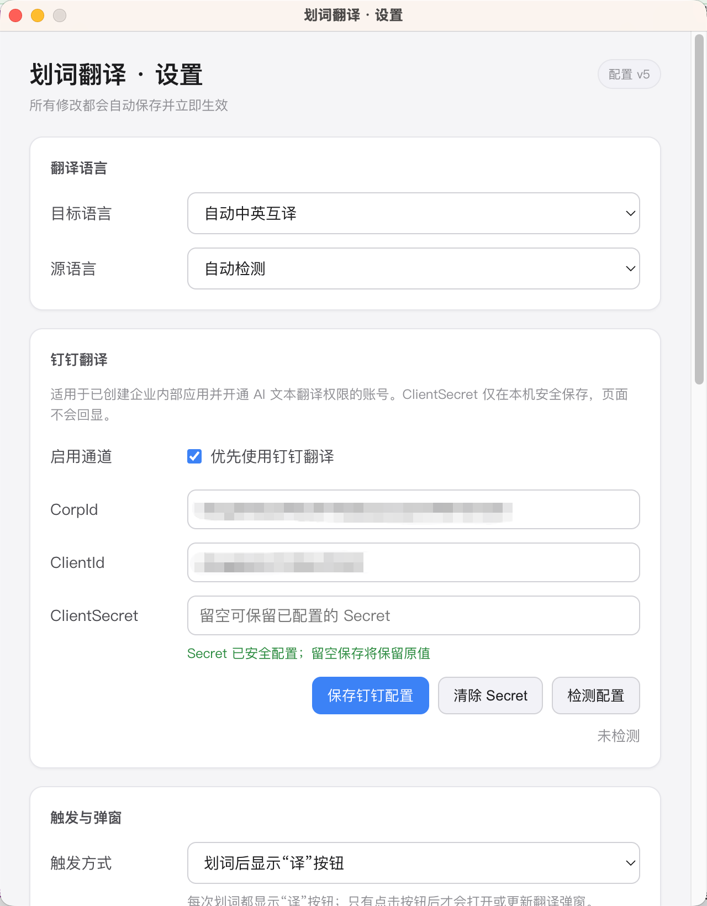
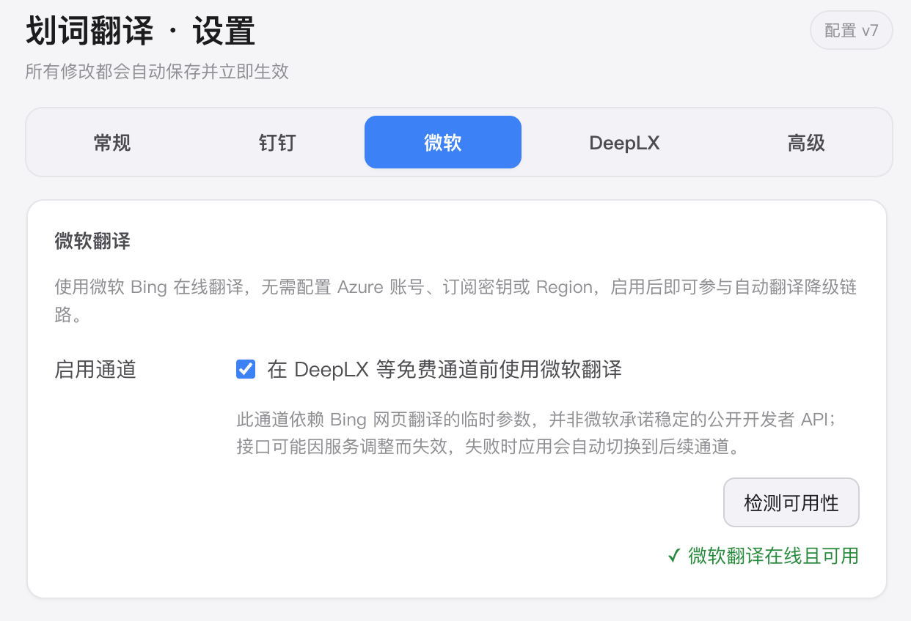
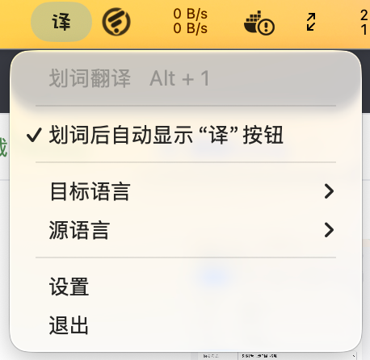
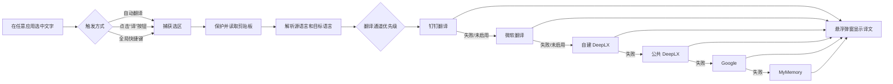

# 划词翻译 · Selection Translator

> 一款支持 macOS、Windows 与 Linux 的全局划词翻译工具。选中文字，使用快捷键或选区旁的“译”按钮，即可在当前内容附近查看译文。

[](https://www.electronjs.org/)
[](https://www.electronjs.org/)
[](https://www.typescriptlang.org/)
[](./package.json)

**版本：`0.1.0`** · **当前界面语言：简体中文**

[English](./README.md) · **简体中文**

---

## 目录

- [产品简介](#产品简介)
- [核心能力](#核心能力)
- [界面截图](#界面截图)
- [工作流程](#工作流程)
- [下载安装](#下载安装)
- [开发环境](#开发环境)
- [运行项目](#运行项目)
- [首次授权：辅助功能](#首次授权辅助功能)
- [快速使用](#快速使用)
- [网页全文翻译](#网页全文翻译)
- [设置说明](#设置说明)
- [翻译通道与降级策略](#翻译通道与降级策略)
- [配置自建 DeepLX](#配置自建-deeplx)
- [配置钉钉企业翻译](#配置钉钉企业翻译)
- [配置微软翻译](#配置微软翻译)
- [隐私与安全](#隐私与安全)
- [项目结构](#项目结构)
- [开发、测试与打包](#开发测试与打包)
- [常见问题](#常见问题)
- [已知限制](#已知限制)
- [参与贡献](#参与贡献)
- [友情链接](#友情链接)
- [许可证](#许可证)

## 产品简介

划词翻译是一款面向 macOS、Windows 与 Linux 的桌面效率工具，常驻系统菜单栏或托盘，不需要复制、切换浏览器或打开独立翻译网页。它通过系统级选区监听和受控的复制取词流程，获取当前应用中的选中文字，并在选区附近显示轻量翻译弹窗。

适合以下场景：

- 阅读英文网页、技术文档、论文和 PDF；
- 在 IDE、终端、Office、即时通讯工具中快速理解单词或短句；
- 需要在不离开当前工作流的情况下反复查看译文；
- 希望使用微软翻译、自建 DeepLX 或企业内部钉钉翻译服务的个人和团队。

## 核心能力

- **全局划词翻译**：支持浏览器、Office、PDF、聊天软件等支持系统复制的应用。
- **三种触发模式**：
  - **自动翻译**：完成划词后直接打开弹窗并开始翻译；
  - **选区按钮**：完成划词后显示“译”按钮，点击后才翻译；
  - **仅快捷键**：划词不自动响应，仅通过全局快捷键触发。
- **轻量悬浮弹窗**：显示原文、译文、语言方向和实际使用的翻译通道。
- **可切换的语音朗读**：点击弹窗中的扬声器图标即可朗读当前有效译文，再次点击可停止，且不会自动播放。默认使用免费、离线优先的系统内置语音，不需要 API Key；也可以在设置中主动启用免费的 Edge 在线神经网络语音，改善部分系统中文音色偏机械的问题。Edge 模式使用固定自然音色、无需 Azure 凭证，失败时会自动回退系统语音。
- **弹窗固定**：点击图钉后，弹窗不会因点击外部或自动隐藏计时而关闭。
- **自动隐藏**：可选择不自动隐藏，或在 3、5、8、15 秒后关闭。
- **语言自动适配**：目标语言为“自动中英互译”时，中文默认翻译为英文，其他文本默认翻译为中文；也支持手动指定源语言和目标语言。
- **多语言支持**：内置中文、英语、日语、韩语、法语、德语、西班牙语、葡萄牙语、意大利语、荷兰语、波兰语、俄语、土耳其语、印尼语、乌克兰语、阿拉伯语、瑞典语、丹麦语、捷克语、希腊语、芬兰语、匈牙利语、罗马尼亚语、斯洛伐克语、保加利亚语、立陶宛语、拉脱维亚语、爱沙尼亚语和斯洛文尼亚语。
- **多通道自动降级**：钉钉翻译、微软翻译、自建 DeepLX、公共 DeepLX、Google 和 MyMemory 按优先级尝试；当前通道失败或熔断时自动切换后续通道。
- **翻译缓存与熔断**：相同文本和语言设置会优先读取缓存；失败通道进入冷却期，避免连续请求拖慢后续划词。
- **剪贴板保护**：取词前保存剪贴板，取词完成后尽量恢复原文本或图片；如果用户在取词期间主动复制，则不覆盖用户的新内容。
- **网络代理**：支持跟随系统代理、直连、自定义 HTTP/HTTPS/SOCKS4/SOCKS5 代理和绕过规则。
- **钉钉企业翻译**：可接入企业内部应用，支持 CorpId、ClientId、ClientSecret 配置、在线检测和显式清除凭证。
- **微软翻译**：通过 Bing 网页翻译链路提供免配置能力，无需 Azure 账号、订阅密钥或 Region，并支持在线检测。
- **网页全文翻译**：使用 Electron 内置阅读器显式提取当前网页，把译文写回原文字位置，支持语言切换和原文恢复。
- **自建 DeepLX**：支持填写自建服务地址，并提供在线检测和 Docker 部署命令生成。
- **明暗主题**：渲染界面跟随操作系统的浅色/深色外观。
- **菜单栏/托盘常驻**：可快速切换源语言、目标语言、打开设置或退出应用。

## 界面截图

以下截图展示选区翻译流程、翻译结果弹窗、标签页式设置界面、微软翻译通道设置和菜单栏/托盘控制菜单。

### 选区翻译

<p align="center">
  
</p>

### 翻译结果

<p align="center">
  
</p>

### 常规设置

<p align="center">
  
</p>

### 微软翻译设置

<p align="center">
  
</p>

### 菜单栏/托盘菜单

<p align="center">
  
</p>

## 工作流程



## 下载安装

### 方式一：一键安装（推荐）

安装脚本会自动识别操作系统与 CPU 架构，从 GitHub Releases 下载对应安装包，下载 `SHA256SUMS` 并验证 SHA-256，然后安装应用并生成默认本地配置。脚本只写入当前用户目录，不要求管理员权限。

**Linux / macOS：**

```bash
curl -fsSL \
  https://raw.githubusercontent.com/zhq734/translation/master/scripts/install.sh \
  | sh
```

**Windows PowerShell：**

```powershell
irm https://raw.githubusercontent.com/zhq734/translation/master/scripts/install.ps1 | iex
```

如需固定版本，可设置 `SELECTION_TRANSLATOR_VERSION`（支持带或不带 `v` 前缀）。为兼容既有一键安装命令，也接受 `GROKBUILD_VERSION`。如项目迁移到其他 GitHub 仓库，可设置 `SELECTION_TRANSLATOR_REPOSITORY=owner/repository`：

```bash
curl -fsSL https://raw.githubusercontent.com/zhq734/translation/master/scripts/install.sh \
  | SELECTION_TRANSLATOR_VERSION=v0.2.0 sh
```

```powershell
$env:SELECTION_TRANSLATOR_VERSION = 'v0.2.0'
irm https://raw.githubusercontent.com/zhq734/translation/master/scripts/install.ps1 | iex
```

兼容命名也可以直接固定版本：

```bash
curl -fsSL https://raw.githubusercontent.com/zhq734/translation/master/scripts/install.sh \
  | GROKBUILD_VERSION=v0.2.0 sh
```

```powershell
$env:GROKBUILD_VERSION = 'v0.2.0'
irm https://raw.githubusercontent.com/zhq734/translation/master/scripts/install.ps1 | iex
```

Linux 会安装 AppImage 到 `~/.local/bin/selection-translator` 并创建桌面入口；macOS 默认安装到 `~/Applications`；Windows 会静默运行 NSIS 安装程序并创建开始菜单/桌面快捷方式。macOS 首次启动仍需在“系统设置 → 隐私与安全性 → 辅助功能”中授权。

### 方式二：下载 GitHub Release

如果需要手动安装，可在 GitHub 的 [Releases](../../releases) 页面下载对应系统的文件：

- **macOS**：下载 `SelectionTranslator-<版本>-mac-<架构>.zip` 或 `.dmg`，打开后将“划词翻译”拖入 `Applications`；
- **Linux**：x64 下载 `SelectionTranslator-<版本>-linux-x86_64.AppImage`，ARM64 下载 `SelectionTranslator-<版本>-linux-arm64.AppImage`，添加执行权限后运行；
- **Windows**：下载 `SelectionTranslator-<版本>-Setup-<架构>.exe`，运行安装向导。

所有安装包应与同一 Release 中的 `SHA256SUMS` 一起发布。当前支持 `x64` 与 `arm64`，详见[开发、测试与打包](#开发测试与打包)。

### 应用内检查与升级

- 正式安装包启动约 5 秒后会静默检查 GitHub Release，但不会未经确认自动下载安装；
- 可在 **设置 → 关于** 查看当前版本、手动检查更新和观察下载进度；支持自动安装的平台可在下载完成后点击“立即重启升级”；
- Windows NSIS 安装包支持应用内下载与重启安装；Linux 仅在从 AppImage 运行时支持自动替换，其他 Linux 安装方式会打开 GitHub Release；
- macOS 只有通过代码签名校验的 `.app` 才启用自动安装。手动安装模式下，点击升级会把当前架构的 DMG 下载到系统“下载”文件夹并自动打开；用户将“划词翻译”拖入“应用程序”覆盖旧版本后，再回到设置页点击“解除 macOS 隔离属性”；
- 无法从更新清单解析出对应 DMG 时会打开 GitHub Release 作为兜底。源码开发模式不会访问更新服务，检查或下载发生异常时设置页也会保留“打开发布页”入口。

> 已经发布的 `V1.0.3` 不包含自动更新代码和 `latest*.yml` / `.blockmap` 元数据，因此该版本用户需要先手动安装一次包含本功能的新版本。之后发布新版本时，必须把安装包、更新元数据、差分文件和 `SHA256SUMS` 上传到同一个 Release。建议后续标签统一使用小写形式，例如 `v1.0.4`。

### 方式三：从源码运行

```bash
# 克隆项目
git clone https://github.com/zhq734/translation.git
cd translation

# 安装依赖
npm install

# 启动 Electron 开发模式
npm run dev
```

> Fork 或迁移仓库后，请同步修改一键安装命令中的 Raw URL，或通过 `SELECTION_TRANSLATOR_REPOSITORY=owner/repository` 覆盖安装脚本的 Release 来源。

## 开发环境

| 项目 | 要求 |
| --- | --- |
| 操作系统 | macOS、Windows 10/11 或 Linux；发布跨平台安装包建议使用对应平台构建机 |
| Node.js | `>= 18`，建议使用 Node.js 20 或更高版本 |
| 包管理器 | npm |
| 桌面框架 | Electron 33 |
| 构建工具 | electron-vite、Vite、electron-builder |
| 编程语言 | TypeScript 5.x |
| 原生依赖 | `uiohook-napi`，用于全局鼠标和键盘事件监听 |

如果 `uiohook-napi` 在本机需要重新编译，请确保本机已安装适用于 Node/Electron 原生模块的编译工具链。

## 运行项目

```bash
# 开发模式：启动 Electron + Vite
npm run dev

# 预览已构建的渲染产物
npm run preview

# TypeScript 类型检查
npm run typecheck

# 执行单元测试
npm test
```

启动成功后，应用不会显示传统主窗口，而是常驻系统菜单栏或托盘。点击“译”图标即可打开语言切换和设置菜单。

## 首次授权：辅助功能

划词取词依赖 macOS 的“辅助功能”权限。应用会优先通过辅助功能接口（`AXSelectedText`）直读当前前台应用的选中文字，直读不可用或为空时才回退到受控的 `Command+C` 模拟复制，因此首次使用前必须授权。

1. 打开 **系统设置 → 隐私与安全性 → 辅助功能**；
2. 在列表中添加并勾选“划词翻译”；
3. 如果使用开发模式，请添加并勾选 `Electron`；
4. 完全退出并重新启动应用；
5. 再次选中文字进行测试。

如果没有权限：

- 自动翻译模式启动时会主动提示并尝试打开系统设置页面；
- 手动触发失败时，翻译弹窗会显示授权提示；
- 未授权时无法稳定读取其他应用中的选中文字。

## 划词取词原理

应用在三个平台上都采用“原生直读优先”的取词管线，只有直读无法满足时才触碰剪贴板：

- **macOS**：通过辅助功能读取前台应用的 `AXSelectedText`；若应用不暴露选区文本（如密码框、未启用辅助功能的应用），则回退到受控 `Command+C` 并读取剪贴板。
- **Windows**：通过 UI Automation（`TextPattern.GetText`）读取焦点控件的选区；若应用不支持 `TextPattern`（如部分传统 Win32 控件、PDF 阅读器），则回退到受控 `Ctrl+C` 并读取剪贴板。
- **Linux**：直接读取 X11 主选区，从不注入复制按键；Wayland 下主选区可能不可读，请在支持 XWayland 的环境中运行或到目标合成器上验证。

当直读与复制兜底都失败时，应用会按失败原因（空选区 / 取词超时 / 应用不支持 / 权限缺失）给出对应提示，不再统一提示“未检测到选中文字”。

平台支持说明：macOS 直读为主要验证平台；Windows 的 UI Automation 覆盖率取决于目标应用是否暴露 `TextPattern` 选区，发布前建议在真实 Windows 机器上对 Chrome/Edge/Office/传统 Win32 应用逐项验证，不支持的应用仍可通过复制兜底取词。

## 快速使用

### 方式一：选区按钮（默认）

1. 在任意支持复制文本的应用中选中文字；
2. 等待选区右上角出现“译”按钮；
3. 点击“译”按钮；
4. 在悬浮弹窗中查看翻译结果。

### 方式二：自动翻译

在设置中将“触发方式”改为“划词后自动打开并翻译”。之后完成选词即可直接打开翻译弹窗。

### 方式三：全局快捷键

默认快捷键为 `Alt+T`。在 macOS 上，`Alt` 对应键盘上的 `Option（⌥）`，因此默认操作是：

```text
选中文字 → 按 Option + T（⌥T）
```

快捷键可在设置中修改。不要将 `Command+C`、`Control+C` 等系统复制快捷键设置为翻译快捷键，应用会拒绝注册这些组合，避免干扰正常复制。

### 弹窗操作

- **手动翻译**：点击文档图标，在划词翻译和手动输入翻译之间切换；
- **朗读译文**：点击扬声器图标使用设置中选择的语音引擎朗读当前译文，再次点击停止；译文不会自动播放，Edge 在线语音失败时会自动回退系统语音；
- **图钉**：固定或取消固定弹窗；
- **复制**：将当前译文写入系统剪贴板；
- **语言选择器**：临时修改源语言和目标语言并重新翻译；
- **齿轮**：打开设置窗口；
- **关闭**：点击“×”或按 `Esc` 关闭弹窗。

## 网页全文翻译

内置网页阅读器使用隔离的 Electron `WebContentsView` 加载 HTTP/HTTPS 页面。可从菜单栏/托盘的“打开网页翻译…”或翻译弹窗入口打开，然后按以下步骤使用：

1. 输入网页地址；主文档根节点出现后即可开始翻译，无需等待页面全部加载完成；
2. 选择源语言（默认自动检测）和目标语言，显式点击“翻译此页”，读取当前页面并启动有界的初始加载翻译窗口；
3. 译文原位替换匹配的原文文本节点，不创建侧栏，也不重建页面结构；
4. 页面仍在加载时，可在顶部状态栏查看已发现、排队中、已完成、失败、取消、缓存命中和部分翻译进度；
5. 在“译文 / 原文”之间切换时无需刷新页面，切回译文会复用当前翻译结果；
6. 切换源语言或目标语言时会取消旧任务、恢复原文，并基于同一页面快照重新翻译；
7. 初始窗口内新渲染的安全文本会在 300 毫秒防抖后分批进入翻译队列；页面停止加载后等待 1,500 毫秒静默期，整个窗口最长运行 30 秒。窗口结束后，后续 SPA 或懒加载内容只会触发补译提示，不会被自动提取或上传。

设置页的“网页全文翻译”分组包含：

| 设置项 | 作用 | 默认值 |
| --- | --- | --- |
| 启用网页翻译 | 启用或关闭弹窗、托盘中的网页翻译入口 | 开启 |
| 翻译范围 | 仅翻译正文，或翻译全部已提取的可见文本 | 仅正文 |
| 最大翻译块数 | 达到块数后停止加入新任务 | 1,000 |
| 最大总字数 | 达到总字数后停止加入新任务 | 500,000 |
| 默认显示 | 译文或原文 | 译文 |

长段落会优先按句子边界拆分，必要时再按安全字符边界切分；翻译通道不会静默截断原文并伪装成功。网页超过块数/字数上限或个别文本单元失败时，顶部状态栏会明确提示“仅翻译了部分网页内容”。已完成的网页翻译会通过有界内存 LRU 缓存复用：页面缓存最多保存 30 个页面、每页最多 3 个语言方向；通用翻译结果缓存最多保存 50,000 条或约 50 MB。上述缓存只存在于内存中，不会写入磁盘。取消、导航、重新翻译、切换语言或关闭阅读器都会让旧任务失效，迟到的通道结果不会覆盖当前页面。原位写回只修改匹配的文本节点值，保留 DOM 结构、链接、按钮、事件、滚动位置和首尾空白；锚点失配时跳过写回并提示页面内容已更新。

隐私与提取边界：

- 应用不会读取 Chrome、Edge、Safari、Firefox 等系统浏览器中已经打开的标签页；
- 仅打开内置阅读器不会采集网页文本，只有用户显式点击“翻译此页”后才开始读取；
- 只读取当前主文档中已经渲染且可见的 DOM，不跨 iframe，不穿透 Shadow DOM，不读取 CSS 伪元素，也不会主动滚动触发懒加载；
- 提取脚本只读；独立的受控写回脚本只修改锚点匹配的文本节点值，不改变 DOM 结构，也不主动发起网络请求；
- 只有进入翻译范围的文本才会发送到用户当前启用的翻译服务。翻译敏感网页前，请自行评估对应服务的隐私和数据保留条款。

## 设置说明

设置窗口支持修改后自动保存并立即生效。

| 设置项 | 说明 | 默认值 |
| --- | --- | --- |
| 目标语言 | 选择固定目标语言，或使用自动中英互译 | 自动中英互译 |
| 源语言 | 选择固定源语言，或自动检测 | 自动检测 |
| 触发方式 | 自动翻译、选区按钮、仅快捷键 | 选区按钮 |
| 全局快捷键 | Electron accelerator 格式，例如 `Alt+T`、`Cmd+Shift+Y` | `Alt+T` |
| 结果自动隐藏 | 选择 0、3、5、8 或 15 秒 | 不自动隐藏 |
| 语音引擎 | 系统内置语音，或免费的 Edge 在线神经网络语音 | 系统内置语音 |
| 代理模式 | 系统代理、直连、自定义代理 | 跟随系统代理 |
| 自建 DeepLX | DeepLX `/translate` 服务地址，留空表示关闭 | 未配置 |
| 钉钉翻译 | 企业内部应用翻译通道 | 关闭 |
| 微软翻译 | 免密钥的 Bing 网页翻译通道 | 关闭 |
| 网页全文翻译 | 内置阅读器与全文翻译入口 | 开启 |
| 网页翻译范围 | 仅正文或全部已提取的可见文本 | 仅正文 |
| 网页翻译上限 | 最大翻译块数和总字数 | 1,000 块 / 500,000 字符 |
| 网页默认显示 | 译文或原文 | 译文 |

### 语音引擎

- **系统内置语音（默认）**：使用操作系统提供的 Web Speech 音色，不会因为朗读产生新的应用侧网络请求，也不需要账号、API Key 或额外费用。应用会为每种语言固定选择稳定的首选音色；中文按 `Xiaoxiao → Meijia → Tingting` 的顺序匹配，英文会避开已知容易失真或音量异常的实验音色。实际音质和可用语言取决于操作系统已安装的语音。
- **Edge 在线神经网络语音**：用户主动启用后，通过微软 Edge 朗读服务生成临时音频，无需 Azure 账号、订阅密钥或 Region。中文固定使用 `zh-CN-XiaoxiaoNeural`，英文固定使用 `en-US-JennyNeural`，并为日语、韩语、法语、德语和西班牙语提供固定音色；播放使用略慢的舒缓语速。
- Edge 模式需要联网，会把当前朗读的译文发送给微软在线服务；请求会复用当前翻译网络会话的代理解析结果。HTTP/HTTPS 代理可以直接使用，当前不支持通过 SOCKS 代理建立 Edge WebSocket，遇到不支持的代理、超时、空音频、网络错误或播放失败时会自动回退系统语音。
- Edge 朗读使用非官方免费接口，服务端点、令牌或请求规则可能变化，不能视为具有稳定性承诺的正式 API。应用不会记录朗读原文，不会把生成音频写入持久化缓存；播放结束或停止后会释放临时音频。

### 配置文件位置

公开设置保存在 Electron 的 `userData` 目录中。根据运行方式，目录名通常为：

```text
# 开发模式
~/Library/Application Support/selection-translator/settings.json

# 打包应用（以 productName 为目录名）
~/Library/Application Support/划词翻译/settings.json
```

钉钉 `ClientSecret` 会单独存放在同一个 `userData` 目录下：

```text
~/Library/Application Support/<userData>/credentials.json
```

微软翻译不需要 Azure 密钥或 Region，因此不会创建微软订阅凭证文件。

不同版本的设置会通过 `schemaVersion` 自动迁移。修改设置文件前请先退出应用，并建议备份原文件。

## 翻译通道与降级策略

翻译请求默认按以下顺序执行：

| 优先级 | 通道 | 启用条件 | 说明 |
| ---: | --- | --- | --- |
| 1 | 钉钉翻译 | 已启用、配置完整、语言对受支持 | 企业内部应用通道；失败后自动降级 |
| 2 | 微软翻译 | 已启用、语言对受支持 | 从 Bing 翻译页面获取临时参数，无需 Azure 密钥或 Region |
| 3 | 自建 DeepLX | 设置了服务地址 | 推荐，适合长期个人使用或内网部署 |
| 4 | 公共 DeepLX | 始终作为默认兜底通道 | 免费公共服务，可能限流或不可用 |
| 5 | Google | 网络可访问 Google 翻译接口 | 使用非官方接口，部分网络需要代理 |
| 6 | MyMemory | 前面通道均失败 | 免费兜底，字符额度和质量受服务限制 |

运行时还会：

- 缓存相同文本、源语言和目标语言组合的结果；
- 在弹窗状态栏显示实际使用的翻译通道；
- 对失败通道执行临时熔断，冷却结束后自动恢复尝试；
- 单次输入最长处理 5000 个字符；微软通道会拆分为每段最多 1000 个字符，Google 和 MyMemory 通道会按各自限制进一步截断请求；
- 钉钉未启用、配置不完整、语言对不支持，或微软翻译未启用、语言对不支持时，不会产生对应网络请求。

公共翻译服务的可用性、限流、配额和服务条款可能随时变化。微软通道依赖非官方 Bing 网页接口，接口不可用时会自动降级。若需要更稳定的个人使用体验，建议部署自建 DeepLX。

## 配置自建 DeepLX

自建 DeepLX 是推荐的稳定方案。完整部署说明请查看：[docs/deeplx-selfhost.md](docs/deeplx-selfhost.md)。

快速流程：

1. 准备 DeepL 免费账号；
2. 按 DeepLX 官方说明获取 `dl_session`；
3. 使用 Docker 启动本地 DeepLX；
4. 在应用设置的“自建 DeepLX”中填入服务地址；
5. 点击“检测是否在线”。

示例部署命令：

```bash
docker run -d \
  --name deeplx \
  --restart unless-stopped \
  -p 1189:1188 \
  -e TOKEN=你的dl_session值 \
  ghcr.io/owo-network/deeplx:latest
```

然后在设置中填写：

```text
http://127.0.0.1:1189/translate
```

> `dl_session` 是敏感凭证，请不要提交到 Git、截图或公开聊天。DeepLX 依赖第三方网页服务，可能因上游改版而暂时失效；请以 DeepLX 官方项目说明为准。

## 配置钉钉企业翻译

钉钉翻译适用于已创建企业内部应用并开通 AI 文本翻译权限的账号。

1. 在钉钉开放平台创建企业内部应用；
2. 为应用开通 **AI 文本翻译** 权限；
3. 在应用设置中准备 `CorpId`、`ClientId` 和 `ClientSecret`；
4. 打开“划词翻译 → 设置…”；
5. 在“钉钉翻译”区域启用通道并填写公开配置；
6. 点击“保存钉钉配置”；
7. 点击“检测配置”，确认 Token 获取和文本翻译链路可用。

安全行为：

- `ClientSecret` 只通过设置页提交给 Electron 主进程；
- 使用 Electron `safeStorage` 加密后单独写入 `credentials.json`；
- 普通 `settings.json`、渲染进程设置快照和日志不会保存或显示明文 Secret；
- ClientSecret 输入框留空并保存其他字段时，会保留旧凭证；
- 如需删除凭证，必须点击“清除 Secret”；
- 配置不完整、语言不支持、权限不足、限流或网络失败时，会自动降级到其他翻译通道。

## 配置微软翻译

微软翻译通道使用 Bing 网页翻译链路，无需 Azure 账号、订阅密钥或 Region。

1. 打开“划词翻译 → 设置…”；
2. 进入“微软翻译”页签；
3. 打开“启用通道”；
4. 点击“检测可用性”，确认当前网络可以访问 Bing 翻译。

运行行为：

- 应用会先加载 Bing 翻译页面并提取短期防滥用参数；
- 随后通过应用当前配置的网络会话请求 Bing 网页翻译接口；
- 临时参数仅缓存在内存中，到期后自动刷新，不会写入凭证文件；
- 网页会话失效时会清理参数并自动重试一次；
- 启用状态变化后会清理微软相关翻译缓存、临时鉴权状态和熔断状态；
- 鉴权、限流、参数、服务或网络错误会经过脱敏，并自动降级到后续通道。

> 该能力使用的是非官方网页接口，并非微软承诺稳定的公开开发者 API。Bing 页面结构或反滥用策略调整都可能导致接口随时失效。建议保留后续兜底通道；需要服务稳定性承诺的正式业务，应改用 Azure Translator 或其他官方 API。

## 隐私与安全

请在使用前了解以下数据流：

1. 应用优先通过平台原生接口直读选区且不触碰剪贴板：macOS 经辅助功能读取 `AXSelectedText`，Windows 经 UI Automation 读取 `TextPattern`，Linux 读取 X11 主选区；仅当直读不可用或为空时才回退到受控的 `Command+C`/`Ctrl+C` 复制；
2. 选中文字会根据当前通道发送给对应的翻译服务；
3. 如果配置了自建 DeepLX，可将请求发送到你的本机、局域网或自有服务器；
4. 如果前序通道不可用，应用会按配置优先级继续请求微软翻译、自建/公共 DeepLX、Google 或 MyMemory；
5. 翻译结果会在本地弹窗中显示，并可由用户主动复制；
6. 语音引擎保持默认的“系统内置语音”时，朗读不会产生新的应用侧网络请求；只有用户主动选择 Edge 在线语音并点击朗读后，当前译文才会发送给微软在线朗读服务生成临时音频。

因此，不建议直接翻译密码、API Key、客户隐私、未公开源代码或其他敏感内容。使用第三方翻译服务时，请自行评估其隐私政策、数据保留、配额和服务条款。

网页全文翻译还遵循额外的显式授权边界：应用无法读取系统浏览器标签页；内置阅读器仅处于打开状态时不会提取内容；只有用户点击“翻译此页”后，应用才读取当前主文档的可见 DOM。阅读器使用独立的持久化 Session，与翻译 API Session 的 Cookie 和缓存隔离；动态页面变化只在本地提示重新翻译，不会自动提取或上传新增文本；进入翻译范围的网页文本仍会发送到设置中启用的翻译服务。

本项目不提供云端账户系统。钉钉凭证仅在对应通道启用并完成配置后使用，Secret 只会持久化到独立的 `safeStorage` 加密文件中，不会以明文写入公开设置。微软翻译只在公开设置中保存启用状态，临时 Bing 网页参数仅保留在内存中，不属于用户凭证。Edge 在线语音同样不需要用户凭证，应用只保存语音引擎选项，不记录朗读原文，也不持久化生成的音频。

## 项目结构

```text
.
├── README.md                         # 默认英文文档
├── README.zh-CN.md                   # 简体中文文档
├── src/
│   ├── main/                         # Electron 主进程
│   │   ├── index.ts                  # 应用入口、托盘、IPC、快捷键与流程编排
│   │   ├── capture.ts                # 剪贴板取词、权限检测与剪贴板恢复
│   │   ├── translate.ts              # 翻译通道、缓存、熔断与降级策略
│   │   ├── network.ts                # 独立翻译网络会话与代理
│   │   ├── autoTrigger.ts            # 全局鼠标/键盘监听
│   │   ├── selectionButton.ts        # 选区旁“译”按钮
│   │   ├── popup.ts                  # 翻译悬浮窗
│   │   ├── settings.ts               # 设置持久化与规范化
│   │   ├── dingtalkConfig.ts         # 钉钉公开配置编排
│   │   ├── dingtalkCredentials.ts    # safeStorage 加密凭证存储
│   │   ├── dingtalkTokenManager.ts   # 钉钉 OAuth Token 管理
│   │   ├── dingtalkTranslation.ts    # 钉钉文本翻译适配器
│   │   ├── microsoftErrors.ts        # 微软错误分类与脱敏
│   │   ├── microsoftLanguage.ts      # 微软语言代码适配
│   │   └── microsoftTranslation.ts   # 免密钥 Bing 网页翻译适配器
│   ├── preload/                      # contextBridge 安全 IPC 桥接
│   ├── renderer/                     # 翻译弹窗、选区按钮与设置页面
│   └── shared/                       # 类型、语言、代理和交互规则
├── tests/                            # Node.js 内置测试 + TypeScript 测试
├── docs/                             # 部署和运维文档
├── scripts/run-tests.mjs             # 测试打包与执行脚本
├── scripts/install.sh                 # Linux/macOS 一键安装脚本
├── scripts/install.ps1                # Windows PowerShell 一键安装脚本
├── scripts/generate-checksums.mjs     # 发布安装包 SHA-256 清单生成脚本
├── electron.vite.config.ts           # Electron/Vite 多入口构建配置
├── package.json                      # npm 脚本、依赖与 electron-builder 配置
└── tsconfig.json                     # TypeScript 配置
```

## 开发、测试与打包

### 常用命令

```bash
# 安装依赖
npm install

# 开发模式
npm run dev

# 类型检查
npm run typecheck

# 单元测试
npm test

# 构建到 out/
npm run build

# 构建 macOS x64/arm64 .app + .dmg + .zip
npm run dist:mac

# 构建 macOS x64/arm64 DMG
npm run dist:dmg

# 构建 Linux x64/arm64 AppImage
npm run dist:linux

# 构建 Windows x64/arm64 NSIS 安装程序
npm run dist:win

# 为 dist/ 中的安装包生成 SHA256SUMS
npm run release:checksums
```

### 构建产物

- `npm run build`：生成 Electron 主进程、preload 和 renderer 产物到 `out/`；
- `npm run dist:mac`：生成 macOS x64/arm64 的 `dmg` 和 `zip` 产物；
- `npm run dist:linux`：生成 Linux x64/arm64 的 AppImage，其中 x64 产物文件名使用 `x86_64`；
- `npm run dist:win`：生成 Windows x64/arm64 NSIS 安装程序 `SelectionTranslator-<版本>-Setup-<架构>.exe`；
- 各平台打包会生成 `latest*.yml` 更新清单；macOS/Windows 另外生成独立 `.blockmap`，Linux AppImage 将差分块信息嵌入文件本身；
- Windows 安装向导支持选择安装目录，并创建桌面和开始菜单快捷方式；
- `npm run release:checksums`：为 `.AppImage`、`.dmg`、`.zip` 和 `.exe` 生成 `SHA256SUMS`；
- 打包输出目录统一为 `dist/`；
- 各平台打包命令显式使用 `--publish never`，只生成本地安装包，避免标签构建时由 electron-builder 隐式发布；
- 发布时必须把所有安装包与 `SHA256SUMS` 上传到同一个 GitHub Release，一键安装脚本才能完成下载与校验；
- 建议在各目标平台完成安装验证；跨平台打包时需要联网下载目标平台 Electron、NSIS 或 AppImage 工具链。

### GitHub Actions 多平台打包

仓库内置 `.github/workflows/package.yml`，可在 GitHub 的 **Actions → 多平台打包 → Run workflow** 中手动执行。手动执行时可以填写版本号，例如 `V1.0.3`；留空则使用 `package.json` 中的版本。

工作流会先运行单元测试和类型检查，然后分别在 macOS、Windows 与 Linux 原生运行器上构建 x64/arm64 安装包，并把各平台产物上传到本次 Actions 运行记录中。推送以 `v` 或 `V` 开头的版本标签时，还会自动完成以下发布步骤：

1. 使用标签中的版本号同步安装包版本；
2. 汇总三个平台的安装包；
3. 生成 `SHA256SUMS`；
4. 新 Release 先以草稿状态创建，上传所有安装包、`latest*.yml`、`.blockmap` 与校验和后再正式发布，避免客户端读取到不完整的更新资产。

macOS 流水线支持签名发布和未签名发布两种模式：

- 五个 Apple 发布 Secret 全部配置时，CI 使用 `npm run dist:mac:ci` 强制完成 Developer ID 签名、Apple 公证，以及 `codesign`、`stapler`、`spctl` 验证；签名证书必须是 `Developer ID Application`，且必须属于固定团队 `TeamIdentifier=499QMYBXLR`；
- 通过 `workflow_dispatch` 手动触发或推送版本标签时，如果没有配置任何 Apple 发布 Secret，CI 自动改用 `npm run dist:mac:unsigned`，生成 x64/arm64 的未签名 DMG 与 ZIP；版本标签构建会把这些产物上传到 GitHub Release；
- 只配置了部分 Secret 时，CI 会列出缺少的名称并停止，避免把错误配置误判为已签名发布；
- 任意自定义名称（例如 `LOCAL`）不会被工作流读取，必须使用下表中的准确名称。

如需正式发布，请在仓库 **Settings → Secrets and variables → Actions** 中配置以下 Repository secrets：

| Secret | 内容 |
| --- | --- |
| `MACOS_CERTIFICATE_BASE64` | 包含私钥的 `Developer ID Application` `.p12` 证书 Base64 单行文本 |
| `MACOS_CERTIFICATE_PASSWORD` | 导出 `.p12` 时设置的密码 |
| `APPLE_API_KEY_P8` | App Store Connect API Key 的 `.p8` 完整文本（包含首尾标记） |
| `APPLE_API_KEY_ID` | App Store Connect API Key 的 Key ID |
| `APPLE_API_ISSUER` | App Store Connect API Key 的 Issuer ID |

可使用以下命令把 `.p12` 转为单行 Base64，再将输出完整写入 `MACOS_CERTIFICATE_BASE64`：

```bash
base64 < DeveloperIDApplication.p12 | tr -d '\n'
```

未签名模式会显式关闭证书自动发现与公证，并使用不依赖 Apple 证书的 ad-hoc 签名重新封装应用，避免 Apple Silicon 包残留无效签名。该模式不需要开发者证书或 Apple 账号，产物可以进入 GitHub Release，但可能被 Gatekeeper 阻止，也不能使用应用内自动安装。应用检测到新版本后，用户在设置页点击升级即可把对应架构的 DMG 下载到系统“下载”文件夹并自动打开；只有更新清单无法提供可直接下载的 DMG 时，才会打开 GitHub Release 作为兜底。

如果历史版本使用 `Apple Development` 签名、其他签名或未签名，macOS 原生更新器都可能因为签名要求不同而拒绝覆盖。此时无需继续重试应用内安装，直接从 GitHub Release 下载 DMG 并手动覆盖旧版本即可。只有持续使用同一团队的 `Developer ID Application` 签名时，才启用应用内自动安装。

#### 安装未签名的 macOS 安装包

仅当安装包来自本仓库可信的 GitHub Actions 或 Release，并且你确认文件来源无误时，才使用下面的处理方式：

1. 在 **设置 → 关于** 点击“下载并打开 DMG”，等待应用把更新包保存到系统“下载”文件夹并打开安装界面；如果自动解析失败，可使用“打开发布页”手动下载；
2. 把“划词翻译”拖入“应用程序”；已有旧版本时选择覆盖；
3. 回到设置页，点击“解除 macOS 隔离属性”，在确认框中确认已经完成覆盖安装；
4. 再启动应用。也可以在终端手动执行下面的固定命令。

```bash
xattr -dr com.apple.quarantine "/Applications/划词翻译.app"
open "/Applications/划词翻译.app"
```

该命令必须在下载并覆盖应用后执行，无法在 GitHub Actions 打包阶段预先永久移除隔离属性。新版设置页只有在 DMG 下载成功并打开后才显示“解除 macOS 隔离属性”；用户完成拖拽覆盖并主动点击该按钮后，应用会再次确认，然后只对固定路径 `/Applications/划词翻译.app` 执行该命令。应用不会调用 `sudo`，失败时会显示可手动执行的命令。配置完整 Apple 凭据可免去大多数 Gatekeeper 手动处理并恢复应用内自动安装，但不是生成 Release 安装包的硬性条件。

建议统一使用小写版本标签，例如发布 `v1.0.4`：

```bash
git tag v1.0.4
git push origin v1.0.4
```

### 测试说明

项目使用 Node.js 内置测试运行器，`scripts/run-tests.mjs` 会先用 esbuild 将 TypeScript 测试临时打包，再执行测试。测试覆盖：

- 划词手势、双击选词和选区锚点；
- 三种触发模式和快捷键保护；
- 剪贴板文本/图片保护与恢复；
- 自动中英互译和手动语言偏好；
- 代理配置构建与设置迁移；
- 钉钉语言适配、OAuth Token、错误分类和通道降级；
- 钉钉 ClientSecret 加密存储、清除和脱敏；
- 微软语言适配、Bing 页面临时参数解析、分块请求、会话刷新、错误分类、缓存重置和通道降级；
- 微软免配置迁移，以及设置页钉钉与微软配置 UI 契约。

提交代码前建议至少执行：

```bash
npm test && npm run typecheck && npm run build
```

## 常见问题

### 1. 划词后没有按钮或没有译文

- 确认已授予“辅助功能”权限；
- 确认设置中的触发方式不是“仅使用快捷键”；
- 如果是快捷键模式，请按已配置的快捷键；
- 完全退出旧进程后重新启动应用；
- 某些应用使用自绘控件或不支持系统复制，无法通过当前取词机制读取文本。

### 2. `npm install` 失败

- 确认 Node.js 版本不低于 18；
- 删除不完整的依赖后重新执行 `npm install`；
- 如果是原生模块编译错误，请安装 Xcode Command Line Tools，并确认当前 Node/Electron 架构匹配；
- 如果 npm 缓存权限异常，可临时使用项目内缓存：

  ```bash
  npm install --cache ./.npm-cache
  ```

### 3. 翻译失败或出现 `429`

公共 DeepLX 可能被限流，Google 可能受网络环境影响。应用会自动尝试后续通道；如果仍不稳定，建议使用[自建 DeepLX](#配置自建-deeplx)，并确认本地服务在线。

### 4. 自建 DeepLX 检测失败

- 确认 Docker 容器正在运行；
- 确认端口没有被其他程序占用；
- 确认地址包含正确的 `/translate` 路径；
- 代理模式为“系统代理”或“自定义代理”时，确认绕过规则保留 `localhost`、`127.0.0.1` 和 `<local>`；
- 在终端中用 `curl` 直接请求端点，排除应用之外的网络问题。

### 5. macOS 提示“应用已损坏，无法打开”

先确认本次 GitHub Actions 的 macOS 构建模式：五个 Secrets 完整时会生成签名公证包；五个 Secrets 全部缺失时会生成未签名安装包。未签名安装包首次打开时，可在确认来源可信后执行：

```bash
xattr -dr com.apple.quarantine "/Applications/划词翻译.app"
open "/Applications/划词翻译.app"
```

此前生成的未签名产物不会自动变成已签名包。未签名包仍可发布和手动安装；如果希望减少 Gatekeeper 提示并启用应用内自动安装，再配置全部五个 Secrets 后重新构建。

如果需要排查已解压的应用，可运行：

```bash
codesign --verify --deep --strict --verbose=2 "/Applications/划词翻译.app"
xcrun stapler validate "/Applications/划词翻译.app"
spctl --assess --type execute --verbose=4 "/Applications/划词翻译.app"
```

未配置 Apple 发布凭据时生成的 GitHub Actions 和本地开发包仍可能被 Gatekeeper 阻止，也不属于经过 Apple 验证的发行包；确认来源可信后可以按上面的步骤手动安装。

如果应用内更新提示 `Code signature ... did not pass validation` 或“代码未能满足指定的代码要求”，说明当前应用与更新包的签名要求不一致。请在设置页点击升级，应用会自动把对应架构的 DMG 下载到系统“下载”文件夹并打开；把“划词翻译”拖入“应用程序”并覆盖旧版本后，回到设置页点击“解除 macOS 隔离属性”。该操作只解除 Gatekeeper 下载隔离属性，不会修复代码签名不匹配，因此更新器仍采用手动覆盖安装流程；如果无法解析 DMG，使用“打开发布页”手动下载即可。

### 6. 钉钉 Secret 保存失败

Electron `safeStorage` 不可用时，应用会拒绝写入明文凭证。请确认系统钥匙串/安全存储可用，并重新启动应用后再尝试；不要手动把 Secret 写入 `settings.json`。

### 7. 微软翻译检测失败

- 此通道不需要 Azure 订阅密钥或 Region，请不要为它创建或粘贴密钥；
- 确认当前网络和代理能够访问 `www.bing.com`；
- 如果 Bing 拒绝临时网页会话或触发限流，请稍后重试；
- 建议保留 DeepLX、Google 或 MyMemory，使运行时可以自动降级；
- 如果 Bing 调整页面结构或反滥用策略，该非官方接入可能需要升级应用后才能恢复。

## 已知限制

- macOS 是当前主要运行验证平台；Linux AppImage 与 Windows NSIS 安装包已纳入发行流程，但全局划词、权限和快捷键仍应在真实目标设备上完成发布前验证；
- 当前应用界面为简体中文，项目分别提供英文 `README.md` 与简体中文 `README.zh-CN.md`；
- 取词依赖系统复制能力，不保证兼容所有自绘文本控件、远程桌面或受限应用；
- 翻译请求依赖网络和第三方服务，钉钉、微软翻译、自建/公共 DeepLX、Google 和 MyMemory 均可能受上游变更影响；其中微软通道使用非官方 Bing 网页接口，可能在没有通知的情况下变化或停止工作；
- 单次输入最长处理 5000 个字符，部分兜底通道有更短的请求限制；
- GitHub Actions 在缺少全部 Apple 发布凭据时会生成未签名 macOS 测试包；该产物以及尚未签名的 Windows 安装包仍可能显示系统安全警告，正式 macOS 发布仍要求签名和公证；
- 项目暂未提供账号体系和云端同步；自动更新依赖 GitHub Release 元数据，本地未签名 macOS 构建和非 AppImage Linux 构建会降级为手动安装。

## 后续方向

以下方向会根据实际需求逐步评估：

- 增加英文及更多语言的应用内界面；
- 接入更多可配置的翻译服务，并完善通道状态管理；
- 使用 macOS Accessibility API 增强对不支持复制控件的取词能力；
- 完善签名、公证、增量更新验证和发行监控；
- 完善 Windows/Linux 真机兼容性、代码签名和自动化发布。

## 参与贡献

欢迎提交 Issue、改进建议和 Pull Request。

建议的贡献流程：

1. Fork 项目并创建独立分支；
2. 先为新行为补充测试，再实现功能；
3. 保持 TypeScript 严格类型检查通过；
4. 不提交真实的钉钉凭证、DeepLX Token、个人配置或构建缓存；
5. 提交前执行：

   ```bash
   npm test && npm run typecheck && npm run build
   ```

6. 在 Pull Request 中说明变更内容、测试结果和可能的兼容性影响。

项目代码注释约定使用简体中文，并在新增或修改的注释中将创建者标记为 `zhenghq`。

## 友情链接

- [LINUX DO](https://linux.do/) —— 本项目在该社区分享

## 许可证

本项目使用 [MIT License](./package.json)。第三方翻译服务、DeepLX、钉钉开放平台及其接口分别受各自的服务条款和许可证约束，使用前请自行确认合规性。

---

## 维护说明

`README.md` 与 `README.zh-CN.md` 中的命令、目录和功能说明应与 `package.json`、`src/`、`tests/` 和 `docs/` 保持同步。新增翻译通道、修改权限模型、变更打包架构或调整凭证存储方式时，请在同一次变更中同步更新两个语言文件。
